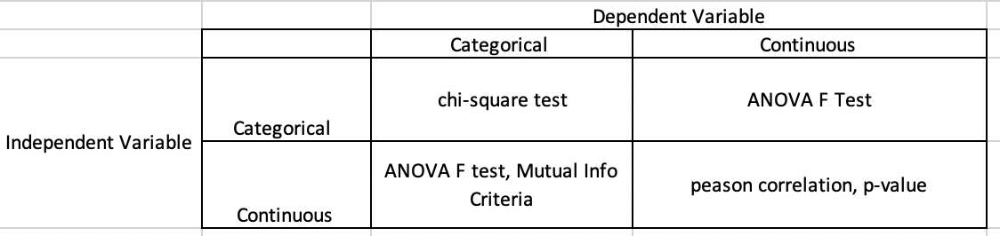

# Lesson 7.2

### Lesson Duration: 3 hours

> Purpose: The purpose of this lesson is to continue working with the data cleaning exercises on categorical variables and numerical variables. We will look at some feature extration techniques and replacing null values for categorical and numerical columns. We will also briefly introduce some advanced feature elimination techniques which will be an important topic of discussion this week. 


- For this lesson, continue working on the same jupyter notebook as 7.01

---

### Learning Objectives: 
After this lesson, students will be able to: 

- Apply data cleaning operations on categorical and numerical columns
- Identify valuable features in a dataset
- Select a precise feature to plot
- Distinguish between feature elimination and data reduction techniques


--- 

### Lesson 1 key concepts
> :clock10: 20 min

- Data cleaning: Categorical Variables 
    - Feature extraction

<details>
  <summary> Click for Code Sample: Feature extraction </summary>

- We will work on the column "DOMAIN". We will first replace the null values with the category that is represented the most and then we will split the data into two columns "DOMAIN_A" and "DOMAIN_B". 

- DOMAIN_A will consist of the first character from DOMAIN

- DOMAIN_B will consist of the second character from DOMAIN

- Then we will drop the original column "DOMAIN"

```python
print(categorical['DOMAIN'].value_counts())
categorical['DOMAIN'] = categorical['DOMAIN'].fillna('R2')
categorical['DOMAIN_A'] = list(map(lambda x: x[0], categorical['DOMAIN']))
categorical['DOMAIN_B'] = list(map(lambda x: x[1], categorical['DOMAIN']))

categorical = categorical.drop(columns=['DOMAIN'])
```
</details>

---

:coffee: __BREAK__

---

#### :pencil2: Check for Understanding - Class activity/quick quiz
> :clock10: 10 min (+ 10 min Review)

<details>
  <summary> Click for Instructions: Activity 1 </summary>

- Use the method value_counts on the columns "MAILCODE", "NOEXCH", and "MDMAUD" and check the proportion of category representation in those columns. Since there is a huge imbalance in the representation of category/categoreis, we will remove this column. Add those columns to the drop_list

</details>

<details>
<summary> Click for Activity Solution </summary>

```python
print(categorical['MAILCODE'].value_counts())
drop_list.append('MAILCODE')

categorical['NOEXCH'].value_counts()
drop_list.append('MDMAUD')

categorical['MDMAUD'].value_counts()
drop_list.append('MDMAUD')
drop_list = drop_list + ['MDMAUD_R', 'MDMAUD_F','MDMAUD_A']

# Ask the students if anyone was able to identify the last three columns, 'MDMAUD_R', 'MDMAUD_F',and 'MDMAUD_A'. Discuss the reason why we can include these columns in the drop list as well
```
</details>

---

:coffee: __BREAK__

---


### Lesson 2 key concepts
> :clock10: 20 min

- Removing columns with similar information (will be more clear with the example)
- Replacing null values 

<details>
  <summary> Click for Code Sample: Removing columns with similar information </summary>

```python
data['RFA_2'].value_counts()

# We will keep the column RFA_2. We will delete rest of the columns 

for col_name in categorical.columns:
    if "RFA" in col_name:
        drop_list.append(col_name)  

drop_list.remove('RFA_2R')
drop_list.remove('RFA_2A')
print(drop_list)


categorical = categorical.drop(columns=drop_list)
categorical.head()
categorical.isna().sum() # final check 
```
</details>

<details>
  <summary>Click for Code Sample: Replacing null values</summary>

```python
print(categorical['CLUSTER'].value_counts())
categorical['CLUSTER'] = categorical['CLUSTER'].fillna('40')

print(categorical['HOMEOWNR'].value_counts())
categorical['HOMEOWNR'] = categorical['HOMEOWNR'].fillna('H')

```
</details>

#### :pencil2: Check for Understanding - Class activity/quick quiz
> :clock10: 10 min (+ 10 min Review)

<details>
  <summary> Click for Instructions: Activity 2 </summary>

- Replace null values in the columns "DATASRCE" and "GEOCODE2"
- For the columns starting with ADATE_ , we will remove these columns. We are assuming that the date when the previous mail was done is not significant in the respondents decision to give donation. They may or may not even remember when they received the mail in the previous years. And for the column ADATE_2, check the values in the column. If the values are pretty much the same, then remove this column as well.

</details>

<details>
<summary> Click for Solution: Activity 2 solutions - 1 </summary>

```python

categorical['DATASRCE'].value_counts()
categorical['DATASRCE'] = categorical['DATASRCE'].fillna('3')
```
</details>


<details>
<summary> Click for Solution: Activity 2 solutions - 2 </summary>

```python
drop_list = []
for col_name in categorical.columns:
    if "ADATE" in col_name:
        drop_list.append(col_name)  


numerical['ADATE_2'].value_counts()

numerical = numerical.drop(columns=drop_list)
```
</details>

---


:coffee: __BREAK__

---

### Lesson 3 key concepts
> :clock10: 20 min

- Working with Numerical Columns 
- Using distribution plots and filling null values 

<details>
<summary> Click for Code Sample: Checking numerical data </summary>

```python
numerical.head()
numerical.shape

# to check the columns with missing values 
df = pd.DataFrame(numerical.isna().sum()).reset_index()
df.columns = ['column_name', 'nulls']
df[df['nulls']>0]

```
</details>


<details>
  <summary> Click for Code Sample: Filling Null Values </summary>

```python
numerical['AGE'] = numerical["AGE"].fillna(np.mean(numerical['AGE']))
sns.distplot(numerical['AGE'])
plt.show()

# Here we are trying to create a distribution plot using the values that are present in the column , excluding the nulls. Otherwise the function will throw an error 
sns.distplot(numerical[numerical['INCOME'].isna()==False]['INCOME']) 
plt.show()
# looks like the variable is actually categorical. We can verify it by using value_counts()
print(numerical['INCOME'].value_counts())
numerical['INCOME'] = numerical['INCOME'].astype('object')
numerical['INCOME'] = numerical['INCOME'].fillna('5.0') # Replacing the null values with the most represented category

```

```python
sns.distplot(numerical[numerical['CLUSTER2'].isna()==False]['CLUSTER2']) 
plt.show()
numerical['CLUSTER2'] = numerical['CLUSTER2'].fillna(np.ceil(np.mean(numerical['CLUSTER2'])))
```

</details>

---

#### :pencil2: Check for Understanding - Class activity/quick quiz
> :clock10: 10 min (+ 10 min Review)

<details>
  <summary> Click for Instructions: Activity 3 </summary>

- Check if there are any other null values in the numerical data
- Clean the columns "WEALTH2" and "TIMELAG". Use appropriate method to fill the null values in these columns 

</details>

<details>
  <summary>Click for Solution: Activity 3 solutions</summary>

```python
df = pd.DataFrame(numerical.isna().sum()).reset_index()
df.columns = ['column_name', 'nulls']
df[df['nulls']>0]


sns.distplot(numerical[numerical['WEALTH2'].isna()==False]['WEALTH2']) 
plt.show()
# print(numerical['WEALTH1'].value_counts())
numerical['WEALTH2'] = numerical['WEALTH2'].astype('object')
numerical['WEALTH2'] = numerical['WEALTH2'].fillna('9.0')
```

```python
numerical['TIMELAG'] = numerical['TIMELAG'].fillna(np.ceil(np.mean(numerical['TIMELAG'])))
```
</details>

---

:coffee: __BREAK__

---

### Lesson 4 key concepts
> :clock10: 20 min

- Why feature selection

- Some feature selection techniques 
    - Univariate Selection using correlations
        - Variance and Correlation
        - Significance of correlation between dependent and independent variable
        - Different Correlation Coeeficients 

**These next methods are only to be breifly introduced. They will be covered later during the week**
- Other methods 
    - Univariate Selection using p-values 
    - Selecting K Best
    - Recursive feature elimination
    - Wrapper methods for feature selection
    - Embedded methods for feature selection


<details>
<summary> Click for Description: Why Feature Selection </summary>

- The objective is to improve the predictibility of the model / learning performace by choosing a smaller subset of features from the original ones that are more relevant in predicting Y, and this decision to choose the more relevant feature is based on a certain relevance evaluation criterion. 

- Reduce noise from information 

- Reduces computational complexity

- Build better generalizable models

- Decrease required storage

</details>

<details>
<summary> Click for Description: Univariate Selection Techniques : Correlations </summary>

- **These are univariate methods as each feature is evaluated independently with the Target, independent of the other features** 

- Explain variance and its significance (already covered in previous units)

- Explain correlation (already covered in previous units)
    - Different correlation coefficients 

- Explain the significance of correlation between each combination of independent variable and dependent variable. Emphasize of the key idea "by building a model we are trying to understand the change in Y with change in X". 
The features that stronly correlated with Y are more important as they provide more information about Y
"a feature is useful if it is correlated with or predictive of the class; other- wise it is irrelevant"

- Some techniques used to find correlation between variables are shown below:


The methods based on F-test estimate the degree of linear dependency between two random variables. On the other hand, mutual information methods can capture any kind of statistical dependency, but being nonparametric, they require more samples for accurate estimation.

    - The key idea here is that we decide on a threshold and based on that we select only those features whose correlation is greater than the threshold


</details>


<details>
<summary> Click for Description: Other Methods </summary>

We can categorize feature selection techniques roughly into these three types -> filter methods, wrapper methods, and embedded methods. We will briefly discuss them here.

- Filter Methods : Filter methods are the techniques that select relevant / important features from the given set of features independent of the machine learning algorithm that we are using. These filter methods can be *univariate* or *multivariate*
    - With univariate methods, each feature is evaluated independently with the Target, independent of the other features
    (https://scikit-learn.org/stable/modules/feature_selection.html#univariate-feature-selection)

    - Multivariate methods take into account all the feature space and hence consider the relation between them as well, while selecting more relevant features 
    - Some of those methods include: 
        - Variance Threshold method - Removes features that have a variance below a threshold. The default value is 0 which means that if all the values in a column are the same, that column will have no variance and that column would be removed. Check additional resources for more information.  

        - Correlation filter methods - Discussed earlier 

        - Variance Inflation Factor - We discussed about VIF in 4.3
        It measures multicollinearity in the numerical data. In other words, it explains how well the variable is explained by other independent variables in the dataset

        - Select K Best based on selection criteria. Please check the documentation
        (https://scikit-learn.org/stable/modules/generated/sklearn.feature_selection.SelectKBest.html)


- Wrapper Methods - These methods use a machine learning algorithm to evaluate a subset of features. The decision of select the subset of features is based on the predictive performance of the model for those set of features. The basic process is as follows:
    - Select a subset of features
    - Build the machine learning model
    - Evaluate the performance 
    - Repeat the process with a new subset of features 
    
    One common method is stepwise feature selection, which can be performed in either of the two ways:
        - Forward Selection - This method starts with selecting one feature, and then keeps on adding one feature in each iteration where the performance of the model is increased. This process is continued until a performance criteria is met (which could be the maximum number of features)

        - Backward Elimination - With this method, we start by including all the features in the dataset and dropping one variable at every iteration, and the algorithm continues until a minimum number of required features is reached. 


- Embedded Methods - These method perform the feature selection process while training the model. Some of the advantages of such methods are:
    - They are faster than wrapper methods
    - They take in account the relationships between features 

    We will talk more about these when we talk about ensemble methods later in the week. 

    Regularization is a technique that is used here, which basically means that we add a penatly to the cost function if we include a feature in our model that is not improving the performance. Since the objective funtion / cost function is targeted to be minimized, the model tries to not include the variables that are not significant. Three common regularization techniques are:
        - Lasso (L1 regularization)
        - Ridge regression (L2 regularization)
        - Elastic Nets 

</details>

---


### :pencil2: Practice on key concepts - Lab
> :clock10: 30 min 

<details>
  <summary> Click for Instructions: Lab </summary>

- Here we will work on cleaning some of the other columns in the dataset using the techniques that we used before in the lessons
    - Check for null values in the numerical columns
    - Use appropriate methods to clean the columns GEOCODE2, WEALTH1, ADI, DMA,and MSA
    - Use appropriate EDA technique whereever necessary  

</details>

<details>
  <summary>Click for Solution: Lab solutions</summary>

```python
df = pd.DataFrame(numerical.isna().sum()).reset_index()
df.columns = ['column_name', 'nulls']
df[df['nulls']>0]
```

```python
categorical['GEOCODE2'].value_counts()
categorical['GEOCODE2'] = categorical['GEOCODE2'].fillna('A')
```

```python
sns.distplot(numerical[numerical['WEALTH1'].isna()==False]['WEALTH1']) 
plt.show()
print(numerical['WEALTH1'].value_counts())
numerical['WEALTH1'] = numerical['WEALTH1'].astype('object')
numerical['WEALTH1'] = numerical['WEALTH1'].fillna('9.0') 
```

```python
sns.distplot(numerical[numerical['ADI'].isna()==False]['ADI']) 
plt.show()
numerical['ADI'] = numerical['ADI'].fillna(np.mean(numerical['ADI']))
```

```python
sns.distplot(numerical[numerical['DMA'].isna()==False]['DMA']) 
plt.show()
numerical['DMA'] = numerical['DMA'].fillna(np.mean(numerical['DMA']))
```

```python
sns.distplot(numerical[numerical['MSA'].isna()==False]['MSA']) 
plt.show()
numerical['MSA'] = numerical['MSA'].fillna(np.mean(numerical['MSA']))
```

</details>

---

:sandwich: __LUNCH BREAK__

---
**Additional Resources**

[Variance Threshold](https://scikit-learn.org/stable/modules/generated/sklearn.feature_selection.VarianceThreshold.html#sklearn.feature_selection.VarianceThreshold)

[Wrapper Methods](https://heartbeat.fritz.ai/hands-on-with-feature-selection-techniques-wrapper-methods-5bb6d99b1274)

[Embedded Methods](https://heartbeat.fritz.ai/hands-on-with-feature-selection-techniques-embedded-methods-84747e814dab)
