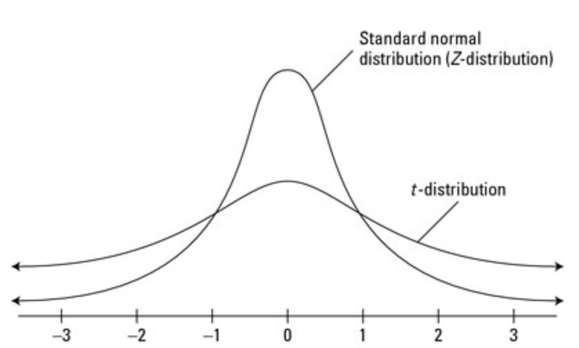
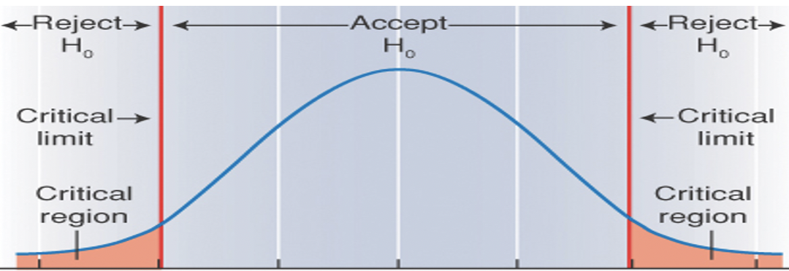

# Lesson 7.3

### Lesson Duration: 3 hours

> Purpose: The purpose of this lesson to show students how to use some simpler filter and wrapper methods discussed in the previous lesson, for feature selection. We will then discuss the concepts of inferential statistics, hypothesis testing and p-values. Later we will develop these concepts into, how they are used to conduct statistical tests to check for significance of variables in a model

---

### Learning Objectives: 
After this lesson, students will be able to: 

- Implement a simple filter method for feature selection -  Variance Threshold
- Implement RFE (Recursive Feature Elimination) wrapper method
- Distinguish between Descriptive Statistics and Inferential Statistics
- Explain the value of hypothesis testing and p-values
- Conduct two tailed, one sample T Test

--- 

### Lesson 1 key concepts
> :clock10: 20 min

- Selecting features based on variance threshold 

<details>
<summary> Click for Description: Using Pearson Correlation coefficient </summary>

- Here we will use variance threshold to remove some features that very low variance, ie those columns have same values in all the rows. Hence such features do not explain anything about the target variable 
</details>


<details>
  <summary>Click for Code Sample </summary>

```python

import pandas as pd
import numpy as np
pd.set_option('display.max_columns', None)
import warnings
warnings.filterwarnings('ignore')
import matplotlib.pyplot as plt
import seaborn as sns 

numerical = pd.read_csv('numerical.csv')
categorical = pd.read_csv('categorical.csv')
targets = pd.read_csv('target.csv')

# Using the variance threshold technique 

from sklearn.feature_selection import VarianceThreshold
sel = VarianceThreshold(threshold=(.9))
# This drops the columns that have a variance less than this threshold
sel = sel.fit(numerical)
temp = sel.transform(numerical)
temp = pd.DataFrame(temp)
print(numerical.shape)
print(temp.shape)

# To check which columns were removed, you can manipulate the results from the code below. This gives the variance of each feature in order of appearance of the dataset. 

sel.get_support()
# This gives you the result as True and False for the columns that we selected and those which were removed, respectively
```

</details>

---

:coffee: __BREAK__

---

#### :pencil2: Check for Understanding - Class activity/quick quiz
> :clock10: 10 min (+ 10 min Review)

<details>
  <summary> Click for Instructions: Activity 1 </summary>

- In this activity, we ask you to implement another algorithm for feature selection, whichs is Select K Best. We have provided a code to you that you can use directly. Your task is to complete the parts missing in the code. 
[https://scikit-learn.org/stable/modules/generated/sklearn.feature_selection.SelectKBest.html]

- Here we are describing a case where the target is categorical and the features are numerical. For this case we will use the chi square method and select top 'K' features

- As you would notice here, one of the disadvantages of using select_k_best is that we have to provide the value of 'k' ourself, through an estimated guess. 

- We will see how the algorithm uses the chi square score to select the top k features

- There is a huge imbalance in the dataset as one category is very under-represented. For now we are checking the application on the data (as it is), but later we will also talk about methods to remove the imbalance 

</details>


<details>
  <summary>Click for Activity Code: Complete the code below:</summary>

```python

X = numerical
y = targets['TARGET_B']

from sklearn.feature_selection import #######
from ############ import chi2
kbest = SelectKBest(chi2, k=10).fit_transform(#, #)
# Here we chose 10 so that is easier to analyze results later, as we will see
selected = pd.DataFrame(#####)
selected.head()

# To check the scores
model = SelectKBest(####, k=10).fit(#, #)
df =pd.########(data = model.scores_, columns = ['score'])
df['Column'] = numerical.columns
# Sorting data
print(df.#########(by = ['score'], ascending = False).head(10))

- Now we have sorted the dataframe in an decreasing order of the scores. The algorithm selects the columns with the largest scores (in this case top 10 scores). You can verify that by comparing the original data and the data returned by select_k_best as now we have the column names for the dataframe that was returned by the algorithm 

# Just to check the columns, we can use the following code
cols = df.sort_values(by = ######, ascending = ######).head(10)['Column']
print(cols)
```

</details>

<details>
  <summary>Click for Solution: Activity 1 solutions</summary>

```python

X = numerical
y = targets['TARGET_B']

from sklearn.feature_selection import SelectKBest
from sklearn.feature_selection import chi2
kbest = SelectKBest(chi2, k=10).fit_transform(X, y)
# Here we chose 10 so that is easier to analyze results later, as we will see
selected = pd.DataFrame(kbest)
selected.head()


# To check the scores
model = SelectKBest(chi2, k=10).fit(X, y)
df =pd.DataFrame(data = model.scores_, columns = ['score'])
df['Column'] = numerical.columns
print(df.sort_values(by = ['score'], ascending = False).head(10))

cols = df.sort_values(by = ['score'], ascending = False).head(10)['Column']
cols
```
</details>

---

:coffee: __BREAK__

---


### Lesson 2 key concepts
> :clock10: 20 min

- Using Recursive Feature Elimination


<details>
  <summary> Click for Description: Recursive Feature Elimination 1 </summary>

- Here we will talk about a wrapper method - Recursive Feature Elimination. 

- The algorithm works like a backward elimination. It starts with all features in the training set and iteratively removes features that are not significant, until the specified number of features is reached.

- This is accomplished by fitting a machine learning algorithm,  which ranks the features by their importance, and iteratively removing the insifnificant features, and re-fitting the model at each iteration. This process is repeated until the specified number of features is reached.

- To select the most relevant features, the algorithm uses "p-value". Here we will discuss how to use the algorithm. In the later session, we will discuss Inferential Statistics, Hypothesis testing, and p-values which are very important concepts in statistics

# Note: The students might feel disconnected from machine learnign but the should emphasize that these are important concepts and data analysts should have a fundamental knowledge in them. Not in every case will they come across a high dimensional dataset (huge number of featues), and in such cases, simpler model and using statistical analysis does the trick faster. 

</details>


<details>
  <summary>Click for Code Sample: Recursive Feature Elimination</summary>

```python
from sklearn.feature_selection import RFE
from sklearn import linear_model
lm = linear_model.LinearRegression()
rfe = RFE(lm, n_features_to_select=20, verbose=False)
rfe.fit(X, y)

# After we run the algorithm, it labels the top features as 1 and the rest are marked in an increasing order of importance. 
df = pd.DataFrame(data = rfe.ranking_, columns=['Rank'])
df['Column_name'] = X.columns
df[df['Rank']==1]
```

</details>

** We will discuss Inferential Statistics, hypothesis testing, and p values in the later sessions**

#### :pencil2: Check for Understanding - Class activity/quick quiz
> :clock10: 10 min (+ 10 min Review)

<details>
  <summary> Click for Instructions: Activity 2 </summary>

- In the previous lessons we have discussed some of the feature selection techniques with you. However there is also something that is called dimensionality reduction. Conduct your research to find the difference between feature selection and dimensionality reduction

</details>

<details>
  <summary>Click for Solution: Activity 2 solutions</summary>

- Explain the conceptual difference between the two 
- There is a folder attached that has an example on how to implement principal component analysis. You are not required to go over it right now. We will ask the students to go over it during the lab 

</details>

---


:coffee: __BREAK__

---

### Lesson 3 key concepts
> :clock10: 20 min

- Transition into Inferential Statistics 

- Using statistical tests to check significance of variables 
   - Descriptive Statistics vs Inferential Statistics
   - Intro to Hypothesis Testing 


<details>
<summary> Click for Description: Transition into Inferential Statistics </summary>

- While using RFE we discussed that it uses p-value to select the most relevant faetures. Now we will learn more about it. To understand p-values, we first need to learn about basics in Inferential Statistics and Hypothesis Testing

</details>


<details>
<summary> Click for Description: Descriptive Statistics vs Inferential Statistics </summary>

- Descriptive Statistic: It is the branch of classical statistics that describes / summarizes the data through some statistics which include mean, median, mode, frequency, standard deviation, and variance. In descriptive statistics, there is no uncertainity as we calculate these statistics on the measured values. 

- Inferential Statistics - It is the branch of classical statistics that helps us to draw inferences about the population, from the given sample data. The basic goal of inferential stats is to draw conclusions from a sample (smaller numnber of subjects/samples) and generalize them on a larger population (for which the complete data is unavailable, we only have sample data)

*Note: The instructor can give a couple of examples for eg. when election polls, and other surveys 


</details>

<details>
<summary> Click for Description: Intro to Hypothesis Testing </summary>

- Hypothesis Testing - It is one of the tools that is used to make inferences on the population (which is called our hypothesis), from the sample data. 

- Elements of hypothesis Tests:
    - Null Hypothesis
    - Alternate Hypothesis
    - Level of Significance 
    - Test Statistic
    - P-value

- We will take a look at the concept with the help of an example in the next lesson
</details>

---

#### :pencil2: Check for Understanding - Class activity/quick quiz
> :clock10: 10 min (+ 10 min Review)

<details>
  <summary> Click for Instructions: Activity 3 </summary>

- Earlier in the unit we talked about probability distributions. What are the two main types of probability distributions. How are they different from each other? Give two examples for each one of them. Also talk about the parameter for each one of those distributions 

- What is the difference between normal distribution and a standard distribution? List down some properties of a normal distribution

</details>

<details>
  <summary>Click for Solution: Activity 3 solutions</summary>

- Discrete Distributions 
- Continuous Distributions 

</details>

---

:coffee: __BREAK__

---

### Lesson 4 key concepts
> :clock10: 20 min

- Simple example on hypothesis testing

<details>
<summary> Click for Description: Hypothesis Testing Example </summary>

- Boys of a certain age are known to have a mean weight of μ = 85 
pounds. A complaint is made that the boys living in a municipal 
children's home are underfed. As one bit of evidence, n = 25 boys
(of the same age) are weighed and found to have a mean weight of 
80.94 pounds. It is known that the population standard deviation 
σ is 11.6 pounds (the unrealistic part of this example!).  
Based on the available data, what should be concluded concerning 
the complaint? 
# Assumption - Samples are drawn from a population which is normally distributed 

- What are we trying to establish here?
   - It is assumed that the population mean weight is 85lbs, but we do not have the complete data from the population. Otherwise we would have calculated the actual mean directly. However we only have sample data from 25 subjects. So based on this sample data we will try to prove or disprove our assumption, using statistical test. 

- Steps for solving this problem:
   - Step1: Define the null hypothesis - This is our assumption about the population. It is defined by H0 and in this case 
        H0: μ = 85
   - Step 2: Define the alternative hypothesis- This means, what if our assumption is not true. It is defined by Ha and in this case
        Ha: μ != 85
 
 Since in this case, our null hypothesis would be false on either side of Ha, hence such a test is called a **Two tailed Test**, ie if Ha: μ > 85 and if Ha: μ < 85, in both cases, H0 is false

   - Step 3: Decide a **test statistics** based on the information available. Assuming data is normally distributed and number of observations are less, we will use a t-test. This test is based on a "student t distribution" which is very similar to standard normal distribution, except it is much flatter

 

   - Step 4: Level of significance: This defines the rejection region / critical region. It is defined by greek letter 'aplha'. Usually it is 0.05

   **NOte** Explain the significance of alpha 

    

    - Step 5: Calculate the test statistic based on the given information

        - If the test statistic falls in the critical region, then we reject the Null Hypothesis
        - If the test statistic falls in the region between the critical region, then we fail to reject the Null Hypothesis, which means we accept the Null Hypothesis ie our assumption about the population to be true

        

- A simple code to perform the calculation is shown below: 

</details>

<details>
<summary> Click for Code: Calculating T statistics </summary>
```python
sample_mean = 80.94
pop_mean = 85
pop_std = 11.6
n = 25
statistic = (sample_mean - pop_mean)/(pop_std/math.sqrt(n))
print("Statistic is: ", statistic)
```
</details>

---


### :pencil2: Practice on key concepts - Lab
> :clock10: 30 min 

<details>
  <summary> Click for Instructions: Lab </summary>

1. It is assumed that the mean systolic blood pressure is μ = 120 mm Hg. In the Honolulu Heart Study, a sample of n = 100 people had an average systolic blood pressure of 130.1 mm Hg with a standard deviation of 21.21 mm Hg. Is the group significantly different (with respect to systolic blood pressure!) from the regular population?

Set up the hypothesis test. Write down all the steps followed for setting up the test. Calculate the test statistic by hand and also code it in python. It should be 4.76190
We will take a look at how to make decisions based on this calculated value. 

2. Students who are able to finish the previous question, please go through the code for principal component analysis. 

</details>

<details>
  <summary>Click for Solution: Lab solutions</summary>

```python
pop_mean = 120
sample_mean = 130.1
sample_std = 21.21
n = 100
statistic = (sample_mean - pop_mean)/(sample_std/math.sqrt(n))
```

</details>

---

:sandwich: __LUNCH BREAK__

---

# RESOURCES 

[One Sample T Test][https://www.jmp.com/en_us/statistics-knowledge-portal/t-test/one-sample-t-test.html]

