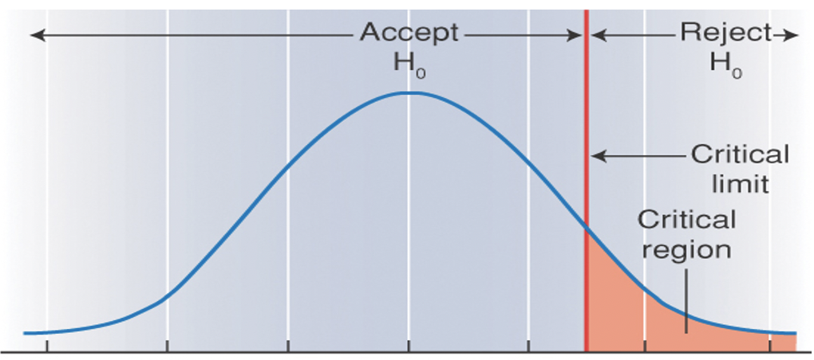
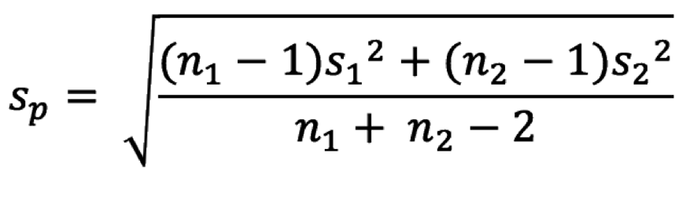
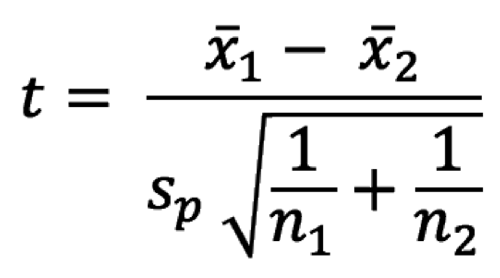
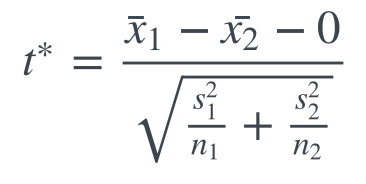

# Lesson 7.4

### Lesson Duration: 3 hours

> Purpose: In this lesson we will look more into hypothesis testing, mainly one sample one sided t-test and two sample t tests (comparison of means). We will also discuss p-values, and their significance. We will see how p-values are used to decide whether to reject the Null Hypothesis or not rejecting it. 

---

### Learning Objectives: 
After this lesson, students will be able to: 

- Articulate inferences on the hypothesis using critical value, p-value
- Create a two-sample T test for comparison of means 
    - Pooled T test   
--- 

### Lesson 1 key concepts
> :clock10: 20 min

- Comparing test statistic vs Critical Value 
- p-values and its significance 

<details>
<summary> Click for Description: Comparing Calculated statistic and Critical Value </summary>

- In the previous lesson we calculated the test statistic and we discussed that: 
        - If the test statistic falls in the critical region, then we reject the Null Hypothesis
        - If the test statistic falls in the region between the critical region, then we fail to reject the Null Hypothesis, which means we accept the Null Hypothesis ie our assumption about the population to be true

- This critical region is defined by a critical value which is symettrical on either side of the Y axis. 

- We use the significance level value, alpha, to check the critical value using a t-table. A copy of t-table is attached in the folder here 

- Now we can compare the calculated statistic and the critical value to see if the null hypothesis is rejected or not. 

</details>

<details>
<summary> Click for Description: Concept of p-values </summary>

  - Using P values is another way of rejecting or failing to reject the Null Hypothesis. We can use it to verify the previous result, ie whether we reject the Null Hypothesis or not. Then we will discuss the meaning of p-values

    - We can also use the t-table to find the p-value from the calculated t-statistic. 

    - Find the p-value from the table and verify the result 

- What is a p-value: Technically p-value is a probability value of rejecting the null hypothesis or failing to reject the null hypothesis. It is used as a direct measure of statistical significance, which we would see later. 
</details>


#### :pencil2: Check for Understanding - Class activity/quick quiz
> :clock10: 10 min (+ 10 min Review)

<details>
  <summary> Click for Instructions: Activity 1 </summary>

- For the example covered in the lab for the last lesson, using the test statistics and then using the p-value, do you reject the null hypothesis or you fail to reject the null hypothesis?

- Here is the question again for reference:
 It is assumed that the mean systolic blood pressure is μ = 120 mm Hg. In the Honolulu Heart Study, a sample of n = 100 people had an average systolic blood pressure of 130.1 mm Hg with a standard deviation of 21.21 mm Hg. Is the group significantly different (with respect to systolic blood pressure!) from the regular population?

  Set up the hypothesis test. 
</details>

<details>
  <summary>Click for Solution: Activity 1 solutions</summary>

- Test statistics was calculated to be 4.761904761904759
- Critical value can be found from the z table in this case 1.98
   Since the statistics is larger than the critical value, it is in the rejection region and hence null hypothesis is rejected

- Using the p-value: P-value in this case is found to be 3.281350908546088e-06. This is very small as compared to 0.05 and brings us in the rejection region. Hence we reject the null hypothesis
</details>

---

:coffee: __BREAK__

---


### Lesson 2 key concepts
> :clock10: 20 min

- One sample one sided t tests
  - Setting up the test
  - Calculating t statistic
  - Drawing inference based on critcal value 

# Note: This session might stretch. So we have kept a simple class activity here

<details>
<summary> Click for Description: One sample one sided T tests </summary>

- In the previous case we looked at one sample two sided t test. 
Note: As an engagement strategy, if you are using a white board, you can write the null hypothesis and alternate hypothesis on the board along with a plot of distribution showing the critical values and the critical regions

- Now we will take a look at one sample one sided t test. As the name suggests, in this case the rejection region is only on one side of the plot



Considering the same example as before, but this time we will only consider the situation where we want to conduct a one sided hypothesis test. 
- Boys of a certain age are known to have a mean weight of μ = 85 
pounds. A complaint is made that the boys living in a municipal 
children's home are underfed. As one bit of evidence, n = 25 boys
(of the same age) are weighed and found to have a mean weight of 
80.94 pounds. It is known that the population standard deviation 
σ is 11.6 pounds (the unrealistic part of this example!).  
Based on the available data, what should be concluded concerning 
the complaint? 

</details>


<details>
  <summary> Click for Description: Problem Set up and Solution </summary>

- Step1: Define the null hypothesis - 
        H0: μ = 85
   - Step 2: Define the alternative hypothesis
        Ha: μ < 85
 
 Since in this case, our null hypothesis would be false on just one side of Ha, hence such a test is called a **One tailed Test** (Right Tailed T test)

   - Step 3: Decide a **test statistics** based on the information available. Assuming data is normally distributed and number of observations are less, we will use a t-test.

   - Step 4: Level of significance: 0.05 in this case again

   - Step 5: Calculate the test statistic based on the given information
        - If the test statistic falls in the critical region, then we reject the Null Hypothesis
        - If the test statistic does not fall in the critical region , then we fail to reject the Null Hypothesis

Now we will calculate the statisitc
</details>

<details>
<summary> Click for Code: Calculating T statistics </summary>

```python
sample_mean = 80.94
pop_mean = 85
pop_std = 11.6
n = 25
statistic = (sample_mean - pop_mean)/(pop_std/math.sqrt(n))
print("Statistic is: ", statistic)

# Statistic is:  -1.75
```
</details>

<details>
<summary> Click for Description: Decision Making: Reject or Fail to Reject Ho </summary>

- Using the t table, we can find the critical value of statistic which is 
**-1.6448536269514729**. Since the test statistic is less than the critical value, it is in the rejection region. Hence we reject the null hypothesis, that the population mean is 85. 

- For the t statistic, you can also check the p value. If the p-value is less than 0.05 then we reject the null hypothesis. For this case it is 0.0401
</details>

---

:coffee: __BREAK__

---

#### :pencil2: Check for Understanding - Class activity/quick quiz
> :clock10: 10 min (+ 10 min Review)

<details>
  <summary> Click for Instructions: Activity 2 </summary>

- Research on Z test 
    - Difference between z test and t test 

</details>

<details>
  <summary>Click for Solution: Activity 2 solutions</summary>

- In the previous examples, we assumed that the distribution of the population data is normally distributed and that the *standard deviation of the population is unknown*. Also the *number of samples was less than 30*. Hence for T TEST was used. 

- If the standard deviation of the population was known (given to us in the data), then we would have used a Z Test. The way the test works is exactly the same, except that instead of a t table, we use the values from a Z Table
</details>

---

:coffee: __BREAK__

---


### Lesson 3 key concepts
> :clock10: 20 min

- Two sample T test (comparison of means)
    - Why do we need to do it 
- Simple example on Two sample T test
    - Problem Description
    - Hypothesis test set up


<details>
<summary> Click for Description: Two sample t test / Comparison of Means </summary>

- Here instead of drawing an inference on one population through its sample data, we try to compare the means of two populations from which two different sample sets are drawn. It helps us to test whether the population means of the two groups are equal or not. 

# It can used to analyze the results from A/B test as well 

- Some of the assumptions on the data before we can use this test are:
    - Populations from which the samples are drawn is assumed to be normally distributed
    - Sample data has continuous values and not discrete
    - Random samples must be drawn from the populations
    - Data in the two samples must be independent of each other 

</details>


<details>
  <summary> Click for Description: Example on Two sample t test </summary>

- A psychologist was interested in exploring whether or not male and female college students have different driving behaviors. There were a number of ways that she could quantify driving behaviors. She opted to focus on the fastest speed ever driven by an individual. Therefore, the particular statistical question she framed was as follows:
Is the mean fastest speed driven by male college students different than the mean fastest speed driven by female college students?
She conducted a survey of a random n = 34 male college students and a random m = 29 female college students. Here is a descriptive summary of the results of her survey:

 Males: 
samples = 34
Sample mean = 105.5 
Sample standard deviation: 20.1

 Females: 
samples = 29
Sample mean = 90.0
Sample standard deviation:12.2

# Please note that in this case we are assuming that the population variances are equal
</details


#### :pencil2: Check for Understanding - Class activity/quick quiz
> :clock10: 10 min (+ 10 min Review)

<details>
  <summary> Click for Instructions: Activity 3 </summary>

- List down all the steps in conducting a hypothesis test, and see if you are able to set up the test yourself. You are free to make any assumptions in your test as you would like

</details>

<details>
  <summary>Click for Solution: Activity 3 solutions</summary>

- Steps in setting up hypothesis Tests:
    - Null Hypothesis 
    - Alternate Hypothesis
    - Level of Significance 
    - Test Statistic
    - P-value

 - Step1: Define the null hypothesis - This is our assumption about the population. It is defined by H0 and in this case 
        H0: μ1 = μ2
   - Step 2: Define the alternative hypothesis- This means, what if our assumption is not true. It is defined by Ha and in this case
        Ha: μ1 != μ2

 Since in this case, our null hypothesis would be false on either side of Ha, hence such a test is called a **Two tailed Test**

 - Step 3: Decide a **test statistics** based on the information available. We will use a t-test.

- Step 4: Level of significance: This defines the rejection region / critical region. In this case we take it to be 0.05

- Step 5: Calculate the test statistic

- Step 6: Make inferences

</details>

---


:coffee: __BREAK__

---

### Lesson 4 key concepts
> :clock10: 20 min

- Calculating the test statistic
- Making inferences using the statistics 

<details>
<summary> Click for Description: Test Statistics </summary>

- As we discussed before, in this case we assume that the population variances are equal. Hence we will use a **Pooled T Test**
- We are assuming that the different assumptions of the test are met, otherwise before you conduct the test you should if samples are independent of each other, values are continuous etc. 

- We start with calculating the pooled sample variance


- Next we calculate the statistic using the below formula 

</details>


<details>
<summary> Click for Code Sample: Calculating the test statistics </summary>

```python
sample_mean1 = 105.5
sample_std1 = 20.1
n1 = 34
sample_mean2 = 90.9
sample_std2 = 12.2
n2 = 29

pooled_sample_std = math.sqrt(((n1-1)*sample_std1**2 + (n2-1)*sample_std2**2)/(n1+n2-2))
statistic = (sample_mean1-sample_mean2)/(pooled_sample_std*math.sqrt((1/n1)+(1/n2)))
print("T Statistic is: ", statistic)

```

</details>

<details>
<summary> Click for Description: Making Inferences </summary>

**Note to The instructor**: Use this in case you feel the students will be comfortable with this code. Otherwise you can use the T Table 

```python
# Using python to find the p value and critical value
print("P value is: ", 1- t.cdf(statistic,n1+n2-2))
print("Critical Value of z is: ", t.ppf(0.025, n1+n2-2)) #alpha is 0.05
```
- Test Statistic: 3.4101131776909535
- Critical Value: -1.9996235841149783
- P-value: 0.0005783712704484634

In this case, since the test statistic is more than the absolute value of "critical value", it is in the rejection region. Hence we reject the null hypothesis. 

Also by looking at the p value directly, we can reject the null hypothesis as it is less than 0.05 

</details>

---

### :pencil2: Practice on key concepts - Lab
> :clock10: 30 min 

<details>
  <summary> Click for Instructions: Lab </summary>

1. We will have another simple example on two sample t test (pooled- when the variances are equal). But this time this is a one sided t-test

In a packing plant, a machine packs cartons with jars. It is supposed that a new machine will pack faster on the average than the machine currently used. To test that hypothesis, the times it takes each machine to pack ten cartons are recorded. The results, in seconds, are shown in the tables in the file machine.txt
Assume that there is sufficient evidence to conduct the t test, does the data provide sufficient evidence to show if one machine is better than the other 

2. ADDITIONAL PROBLEM (not necessary). In this case we cannot assume that the population variances are equal. Hence in this case we cannot pool the variances

- Independent random samples of 17 sophomores and 13 juniors attending a large university yield the following data on grade point averages. Data is provided in the file student_gpa.txt

At the 5% significance level, do the data provide sufficient evidence to conclude that the mean GPAs of sophomores and juniors at the university differ?

Test statistics can be calculated as :


Degrees of freedom is (n1-1)+(n2-1)
</details>

<details>
  <summary>Click for Solution: Lab solutions Part 1</summary>

Data : 

Machine 1: 
mean = 42.14
standard deviation = 0.683
samples = 10

Machine 2: 
mean = 43.23
standard deviation = 0.750
samples = 10

        H0: μ1 = μ2
        Ha: μ1 < μ2
        significance level 0.05

        pooled standard deviation is 0.7173
        test statistic = -3.398

      It is a left tailed test with a critical value of -1.7341

      test statistic < critical value, hence we are in the rejection region. We reject the null hypothesis. Alternative hypothesis is true. Machine 2 is faster

</details>


<details>
  <summary>Click for Solution: Lab solutions Part 2</summary>

Data : 

Sophomore: 
mean = 2.8
standard deviation = 0.52
samples = 17

Junior: 
mean = 2.981
standard deviation = 0.3093
samples = 13

        H0: μ1 = μ2
        Ha: μ1 != μ2
        significance level 0.05

        test statistic = -0.92
        Critical value = -2.048


      test statistic > critical value, hence we are not in the rejection region. We fail to reject the null hypothesis. Hence there is not sufficient evidence to reject the null hypothesis

      Also p value here is 0.36 which is larger than 0.05
</details>


---

:sandwich: __LUNCH BREAK__

---

# RESOURCES 
[Two Sample T Test][https://www.itl.nist.gov/div898/handbook/eda/section3/eda353.htm]
