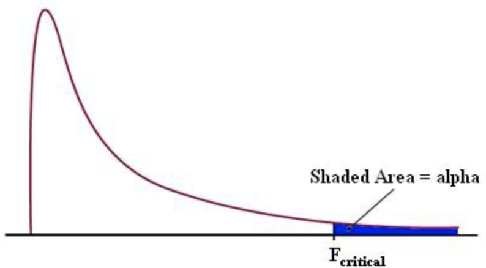
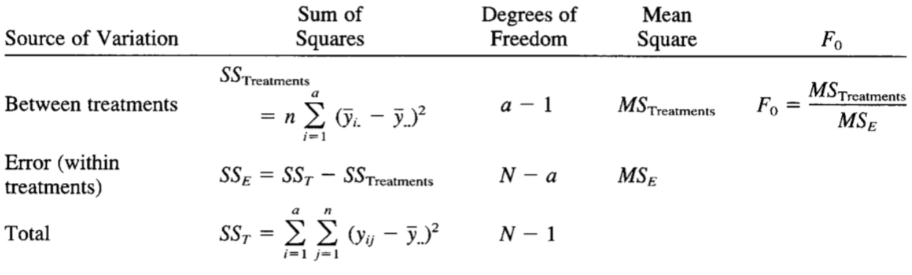
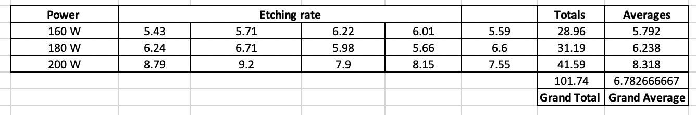
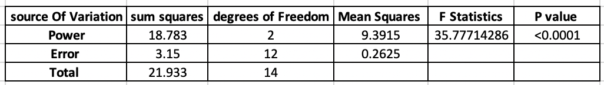

# Lesson 7.5

### Lesson Duration: 3 hours

> Purpose: In this lesson we will introduce one way ANOVA (analysis of variance) and look at its application. We will then take a look into a multivariate linear regression model and see how to apply the concept of p-values 

---

### Learning Objectives: 
After this lesson, students will be able to: 

- Explain the value of One Way ANOVA 
- Work on a case study using ANOVA
- Use F table and F statistics
- Implement ANOVA using python
--- 

### Lesson 1 key concepts
> :clock10: 20 min

- Introduction to One Way ANOVA 
- Cases where ANOVA is useful
- Simple Example On ANOVA

<details>
<summary> Click for Description: What is ANOVA </summary>

- In the previous case we looked at statistical tests for comparison of means. What if we have samples from more than 2 groups. One way ANOVA helps us to solve such problems 

- One way ANOVA (analysis of variance) is a statistical test that is used to 
test if there is any difference between the means of the three or more groups/populations 

- It is called analysis of variance because it is based on partitioing the total variance in the data into two components (within treatment / group variance and between treatment / group variance). We will understand what that means in the later lessons

</details>

<details>
<summary> Click for Description: Simple Example On ANOVA </summary>

Note: Through the problem statement, give the students an idea on what kind of questions ANOVA can help us answer

- You are working as an analyst for a soft drink distributor. The regioal manager thinks that display design near the product stocks have an effect on the sales of the product. The design team designed four new display and they want to see their effectiveness. These displays were used at different stores and increase in sales were recorded, in the same time frame. Data was collected and it was provided to you. Your task is to conduct statistical test on this data and check if display signs impact sales or not. 

- Data collected is shown below


</details>

<details>
<summary> Click for Description: Cases where ANOVA is useful </summary>

- As we could see from the previous example, it's very similar to A/B testing except that here we are testing on more than two levels. 

- It is particularly useful for checking if a particular independent process variable impacts the output of a process or not. 

- Another important thing, as we would see later as well, is that it does tell us if there is a difference in the means of any two groups but it does not tell us which two groups are actually different 
Note: If the students are confused by this, ask them to not think about it much. We will discuss this later in detail
</details>

---

:coffee: __BREAK__

---

#### :pencil2: Check for Understanding - Class activity/quick quiz
> :clock10: 10 min (+ 10 min Review)

<details>
  <summary> Click for Instructions: Activity 1 </summary>

- List down three more examples of cases where ANOVA could be useful. 

# The students will then talk about one case each 

</details>

<details>
  <summary>Click for Solution: Activity 1 solutions</summary>

- Class discussion

</details>

---

:coffee: __BREAK__

---


### Lesson 2 key concepts
> :clock10: 20 min

- Setting up ANOVA and some key terms 
    - Null Hypothesis 
    - Alternate Hypothesis
    - Level of Significance 
    - Test Statistic
    - P-value

- F table

<details>
<summary> Click for Description: Setting up ANOVA and Key Terms </summary>

- Null Hypothesis:
    H0: μ1 = μ2 = ...... = μk
    where k is the number of levels/groups we have for that treatment

    Treatment is the parameter that we are changing, which is "display design" in our example. 
    k = 4 in this case - design 1, design 2, design 3, design 4

- Alternate Hypothesis
   Ha: not all means are equal

    The null hypothesis is rejected if there is a difference in the means of any of the groups. All the groups need not be different from each other. 
    In our case, even if means for design 1 = design 2 but design 2 != design 3, then we should still reject the null hypothesis


- Level of Significance 
    Here also we will take it to be 0.05

- Test Statistic
    To conduct ANOVA, we calculate F statistics which is based on F distribution
    
    

    We check the critical value for the given level of significance from the F Table and compare it with the F Statistic calculated and then take a decision on where to reject the null hypothesis or not

    If the calculated F statistic is greater than the critical value, we reject the null hypothesis (as we would be in the rejection region)

- P-value

  Based on the F Statistic we can also calculate the p-value 

  If the p-value is less than 0.05, then we reject the null hypothesis as we would be in the rejection region
</details>


<details>
  <summary> Click for Descriptions: F Table </summary>

- This is a general representation of the data collected for the ANOVA experiment 


- Using the information above, we calculate values mentioned in the table below:


As we mentioned before, ANOVA is based on decomposing the total variance in the data in two main components -> within treatment variance, between treatment variance 

SST: Sum Square Total -  This is the total variance 
SS_Treatment: Sum Square Treatment - This denotes the within treatment variance
SSE: Sum Square Error - This denotes the between treatment variance 

Hence, SST = SS_Treatment + SSE 

- since we will be using python to conduct one way ANOVA, we will not get into the details of how to calcuate SST, SS_Treatment by using formulas
</details>

#### :pencil2: Check for Understanding - Class activity/quick quiz
> :clock10: 10 min (+ 10 min Review)

<details>
  <summary> Click for Instructions: Activity 2 </summary>

- What are some of the assumptions of one way ANOVA?
This is one good resource that you can use to read more about ANOVA and other statistics content
[https://online.stat.psu.edu/stat500/lesson/10/10.2/10.2.1]

</details>

<details>
  <summary>Click for Solution: Activity 2 solutions</summary>

These are the assumptions of ANOVA:

- The responses for each factor level have a normal population distribution.
- These distributions have the same variance.
- The data are independent.

</details>

---


:coffee: __BREAK__

---

### Lesson 3 key concepts
> :clock10: 20 min

- Reading the F table
- Checking the critical value
- Drawing inferences 
- Conclusion

<details>
<summary> Click for Description </summary>

# Lets assume we conducted the ANOVA analysis we get the F table as shown below:
- Reading the F table

  - Degrees of Freedom 
  - Calculation of Mean square values (Ratio of Sum Square and DoF)
  - Calculating F Statistics using Mean Square Values 

- Checking the critical value using degrees of freedom, and significance level alpha  
 - Note: Explain to the students how they can use the F dsitribution table to find the critical value. Link to F distribution table is shown below:
 [https://web.ma.utexas.edu/users/davis/375/popecol/tables/f005.html]
 - From the distribution table we can see that the critical value for the given significance level and the degrees of freedom, is 3.24
- Drawing inferences 
  - Since F0 (test statistic) > 3.24 (F_critical), we reject the null hypothesis
  - Since the p-value is less than 0.05, we can also reject the null hypothesis
- Conclusion: Since we rejected the null hypothesis, we can conclude that there is a difference in increase in sales when the desing of the display is changed. But we do not know, which groups are actually different from each other 

</details>

---

#### :pencil2: Check for Understanding - Class activity/quick quiz
> :clock10: 10 min (+ 10 min Review)

<details>
  <summary> Click for Instructions: Activity 3 </summary>

- In this lab, we will look at another example. Your task is to understand the problem and write down all the steps to set up ANOVA. After the next lesson we will ask you to solve this problem using python

  - Suppose you are working as an analyst in a microprocessor chip manufacturing plant. You have been given the task of analysing a plasma etching process with respect to changing Power (in Watts) of the plasma beam. Data was collected and provided to you to conduct statistical analysis and check if changing the power of the plasma beam has any effect on the etching rate by the machine. You will conduct ANOVA and check if there is any difference in the mean etching rate for different levels of power. 

- State the null hypothesis
- State the alternate hypothesis
- What is the significance level
- What are the degrees of freedom of model, error terms, and total DoF

  - Data was collected randomly and provided to you in the table as shown below:



</details>

<details>
  <summary>Click for Solution: Activity 3 solutions</summary>

- ANOVA set up 

</details>

---

:coffee: __BREAK__

---

### Lesson 4 key concepts
> :clock10: 20 min

- Implementation in Python
- Discussion on code results 

<details>
<summary> Click for Code Sample </summary>

```python
import statsmodels.api as sm
from statsmodels.formula.api import ols
import pandas as pd

data = pd.read_excel('anova_class_example_data.xlsx', sheet_name='data_collected')
data.head()

model = ols('Percent_increase_in_sales ~ C(Display_design)',data=data).fit()
table = sm.stats.anova_lm(model)
print(table)
```
</details>

</details>

<details>
  <summary>Click for Description: code discussion</summary>

- Here we are using statmodels library in python to conduct ANOVA
- It uses a linear OLS model 
- We can make inference using p-value here 
  - Since the p value is very small, we reject the null hypothesis
</details>
---


### :pencil2: Practice on key concepts - Lab
> :clock10: 30 min 

<details>
  <summary> Click for Instructions: Lab </summary>

- In this section, use python to conduct ANOVA
- What conclusions can you draw from the experiment and why

</details>

<details>
  <summary>Click for Solution: Lab solutions</summary>

- F table


- We reject the null hypothesis here

</details>

---

:sandwich: __LUNCH BREAK__

---