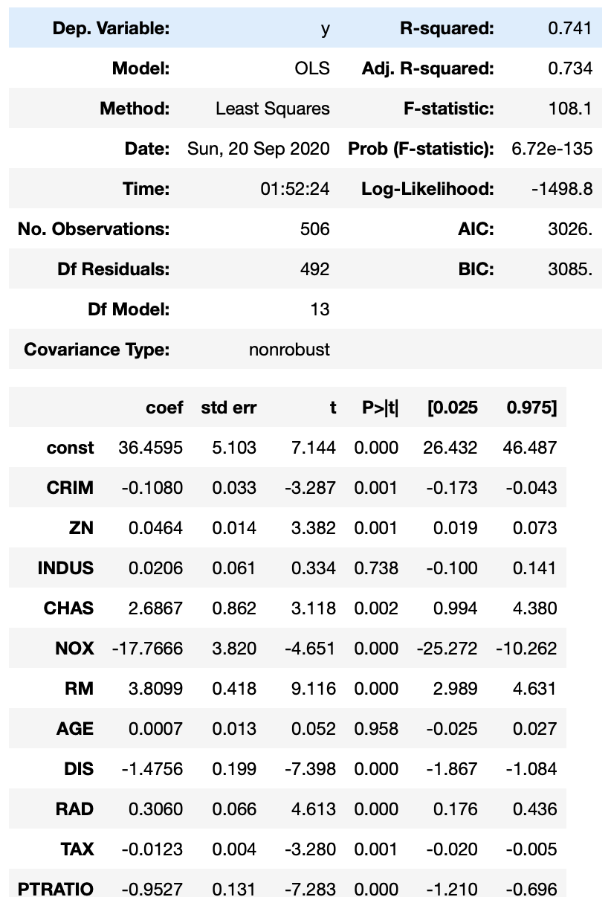

# Lesson 7.6

### Lesson Duration: 3 hours

> Purpose: In this lesson we will see how we can use the concept of p-values learnt in the previous lessons to implement feature selection process. We will then take a look at our case study and start with building a model to solve the classification problem (predict the people who are more likely to respond to the promotion mails). Here we will look at a few upsamapling and downsampling techniques to resolve data imbalance in classification models 

---

### Learning Objectives: 
After this lesson, students will be able to: 

- Use p-values for feature selection
- Resolve data imbalance with upsampling techniques 
- Resolve data imbalance with downsampling techniques 
--- 

### Lesson 1 key concepts
> :clock10: 20 min

- Use Statmodels library to build a simple regression model 
- Conduct feature selection using p-values 

<details>
<summary> Click for Description </summary>

- Here we will show a simple implementation of how to use p-values to select siginificant faetures in the model 
- We will use the "boston" dataset from sklearn library to predict the median house value based on certain features provided in the dataset 
- In this case we will not perform data cleaning as this is only to show the application of p-values 

</details>


<details>
<summary> Click for Code Sample </summary>

```python
import pandas as pd
import numpy as np
pd.set_option('display.max_columns', None)
import warnings
warnings.filterwarnings('ignore')
import statsmodels.api as sm
from sklearn.datasets import load_boston

x = load_boston()
y = x.target
X = pd.DataFrame(x.data, columns = x.feature_names)

X_added_constant = sm.add_constant(X)
# we need to add this constant value of 1 for the intercepts
model = sm.OLS(y,X_added_constant).fit()
model.summary()
```
</details>

<details>
  <summary> Click for Description </summary>

- The summary of the initial looks like this 


- We would now remove the features that have a p-value greater than 0.05,in this case columns "INDUS" and "AGE". 

</details>

<details>
<summary> Click for Code Sample </summary>

```python
X = X.drop(['INDUS','AGE'], axis=1)
```
</details>

---

:coffee: __BREAK__

---

#### :pencil2: Check for Understanding - Class activity/quick quiz
> :clock10: 10 min (+ 10 min Review)

<details>
  <summary> Click for Instructions: Activity 1 </summary>

- In the lesson we used a linear regression model to check the significant variables in the model and we removed a two variable which were not significant, based on the p-values. Now build a model on the remaining data and check if any other variable/variables turn out be insignificant

- How is R squared measure different than adjusted R squared? Compare the values for R square and adjusted R square in the two models 

</details>

<details>
  <summary>Click for Solution: Activity 1 solutions</summary>

- In this solution we are removing the features from the original data and then adding a constant and storing the dataframe in the variable "X_added_constant"
```python
X_added_constant = sm.add_constant(X)
model = sm.OLS(y,X_added_constant).fit()
model.summary()
```

- You can also drop the variables from "X_added_constant" directly and then use it in the model, as shown below:

```python
X_added_constant = X_added_constant.drop(['INDUS','AGE'], axis=1)
model = sm.OLS(y,X_added_constant).fit()
model.summary()
```
</details>

---

:coffee: __BREAK__

---


### Lesson 2 key concepts
> :clock10: 20 min

- Mail marketing case study
- Problems with modeling when there is data imbalance

<details>
<summary> Click for Description </summary>

- Now we will go back to our original case study. As discussed before, to solve this problem we will first work on the classification problem. 

```python
import pandas as pd
import numpy as np
pd.set_option('display.max_columns', None)
import warnings
warnings.filterwarnings('ignore')

numerical = pd.read_csv('numerical.csv')
categorical = pd.read_csv('categorical.csv')
targets = pd.read_csv('target.csv')
print(targets['TARGET_B'].value_counts())

 # As we can see there is a huge imbalance in the data in the representation of the two categories. Category 0 is represented 4843 times and category 1 is represented 90569 times. 

# For demonstration purposes we will use only numerical features 
data = pd.concat([numerical, targets], axis=1)

# Dropping target D as this would be the target later, after we predict who is more likely to donate 
data = data.drop(['TARGET_D'], axis=1)
data.head()
``` 

<details>
<summary> Click for Description: Problems with modeling when there is data imbalance: What if we build the model right away, without managing the imbalance</summary>

- Binary classification problems are usually used for cases where model has to identify some rare but critical even such as fraud/intrusion detection, process failures, and medical diagnosis/monitoring. And generally one would see that there is a huge imbalance in the representation of the two classes in such cases. And the class that is of interest is usually under-represented.

- Lets take a simple explanation. In our case, category 0 is represented 90569 times (which is 94.9% of the total samples) while category 1 is represented 4843 times. Even if we do not spend the time in data cleaning and data processing and making a machine learning model, and simply mark the predictions as 0 for all the cases, one can say that over 94% of the times we made the correct prediction. But we cannot just randomly make this guess on some new data on which we have to make the predictions

- A conventional model will not make a reliable and accurate prediction if there is imbalance in the data. The model will be biased towards the class that has more representation. The minority class might be treated as a noise in the model

</details>


</details>


#### :pencil2: Check for Understanding - Class activity/quick quiz
> :clock10: 10 min (+ 10 min Review)

<details>
  <summary> Click for Instructions: Activity 2 </summary>

# Note: This could be an activity where the class can work together to brainstorm

- Research and discuss some potential causes of data imbalance
</details>

<details>
  <summary>Click for Solution: Activity 2 solutions</summary>

- Predicting a rare event, which is usually the case with binary classification problems (as discussed in the lesson)

- Biased sampling/ sampling was not randomized - Imbalance can also be due to the way the samples were collected or sampled from the problem domain. For eg. if you were collecting data from a company but took maximum samples from employees in a particular department

- Measurement errors could be potential error as well

</details>

---


:coffee: __BREAK__

---

### Lesson 3 key concepts
> :clock10: 20 min

- Managing data imbalace 
    - Downsampling 
    - Upsampling - Method 1

<details>
<summary> Click for Code Sample: Downsampling </summary>

```python
category_0 = data[data['TARGET_B'] == 0]
category_1 = data[data['TARGET_B'] == 1]

category_0 = category_0.sample(len(category_1))
print(category_0.shape)
print(category_1.shape)

data = pd.concat([category_0, category_1], axis=0)
#shuffling the data
data = data.sample(frac=1)
data['TARGET_B'].value_counts()
```
</details>

<details>
<summary> Click for Code Sample: Upsampling </summary>

```python
data = pd.concat([numerical, targets], axis=1)
data = data.drop(['TARGET_D'], axis=1)
category_0 = data[data['TARGET_B'] == 0]
category_1 = data[data['TARGET_B'] == 1]

# Upsampling 
category_1 = category_1.sample(len(category_0), replace=True)
print(category_1.shape)

data = pd.concat([category_0, category_1], axis=0)
#shuffling the data
data = data.sample(frac=1)
print(data['TARGET_B'].value_counts())
```
</details>

---

#### :pencil2: Check for Understanding - Class activity/quick quiz
> :clock10: 10 min (+ 10 min Review)

<details>
  <summary> Click for Instructions: Activity 3 </summary>

- Despite the advantage of balancing classes, these techniques also have their weaknesses (there is no free lunch). Brainstorm and discuss some of the disadvantages of upsampling and downsampling

</details>

<details>
  <summary>Click for Solution: Activity 3 solutions</summary>

The simplest implementation of over-sampling is to duplicate random records from the minority class, which can cause overfitting. 

In down-sampling, the simplest technique involves removing random records from the majority class, which can cause loss of information.

</details>

---

:coffee: __BREAK__

---

### Lesson 4 key concepts
> :clock10: 20 min

- Other more sophisticated techniques 
  - Upsamling using SMOTE (Synthetic Minority Oversampling TEchnique)
  - Downsampling TomekLinks 

<details>
<summary> Click for Description: Upsampling with SMOTE </summary>

- The SMOTE algorithm can be broken down into following steps:

  - Randomly pick a point from the minority class.
  - Compute the k-nearest neighbors (for some pre-specified k) for this point.
  - Add k new points somewhere between the chosen point and each of its neighbors.
</details>

<details>
<summary> Click for Code Sample: Upsampling with SMOTE</summary>

```python
from imblearn.over_sampling import SMOTE
smote = SMOTE()
y = data['TARGET_B']
X = data.drop(['TARGET_B'], axis=1)
X_sm, y_sm = smote.fit_sample(X, y)
y_sm.value_counts()
```
</details>

<details>
<summary> Click for Description: Downsampling with Tomeklinks </summary>

- Tomek links are pairs of very close instances, but of opposite classes. Removing the instances of the majority class of each pair increases the space between the two classes, facilitating the classification process

- It does not make the two classes equal but only removes the points from the majority class that are close to other poitns in minority class
</details>

<details>
<summary> Click for Code Sample: Downsampling with Tomeklinks</summary>

```python
from imblearn.under_sampling import TomekLinks
tl = TomekLinks('majority')
X_tl, y_tl = tl.fit_sample(X, y)
y_tl.value_counts()
```
</details>
---


### :pencil2: Practice on key concepts - Lab
> :clock10: 30 min 

<details>
  <summary> Click for Instructions: Lab </summary>

- For this lab and in the mext lessons we will build a model on customer churn binary classification problem. You are working as an analyst with this internet service provider. You are provided with this historical data about your company's customers and their churn trends. Your task is to build a machine learning model that will help the company identify customers that are more likely to default/churn and thus prevent losses from such customers. 

- In this lab we will first take a look at the degree of imbalance in the data
and correct it using the techniques we learnt in class 

- Here is the list of steps to be followed (building a simple model without balancing the data):
    - Import the required libraries and modules that you would need
    - Read that data into python and call the dataframe "churnData"
    - Check the datatypes of all the columns in the data. You would see that the column "TotalCharges" is object type. Convert this column into numeric type using pd.to_numeric function
    - Check for null values in the dataframe. Replace the null values
    - In this case we will use the following features, "tenure", "SeniorCitizen", "MonthlyCharges", and "TotalCharges" 
    - Scale the features either by using normalizer or a standard scaler
    - Split the data into a training set and a test set 
    - Fit a logistic regression model on the training data
    - Check the accuracy on the test data
# note: so far we have not balanced the data 


- Managing imbalance in the dataset
    - Check for the imbalance 
    - use the resampling strategies used in class for upsampling and downsampling to create a balance between the two classes
    - Each time fit the model and see how the accuracy of the model is 
</details>

<details>
  <summary>Click for Solution: Lab solutions - building a simple model without balancing the data</summary>

- Reading the data
```python
import pandas as pd
import numpy as np
from sklearn.linear_model import LogisticRegression
from sklearn.preprocessing import StandardScaler
from sklearn.model_selection import train_test_split

pd.set_option('display.max_columns', None)
import warnings
warnings.filterwarnings('ignore')
churnData = pd.read_csv('Customer-Churn.csv')
churnData.head()
```
- Processing data
```python
churnData.dtypes
churnData['TotalCharges']  = pd.to_numeric(churnData['TotalCharges'], errors='coerce')
churnData.isna().sum()
churnData['TotalCharges'] = churnData['TotalCharges'].fillna(np.mean(churnData['TotalCharges']))

X = churnData[['tenure', 'SeniorCitizen','MonthlyCharges', 'TotalCharges']]
Y = pd.DataFrame(data=churnData, columns=['Churn'])
transformer = StandardScaler().fit(X)
scaled_x = transformer.transform(X)
```

- Building the model 
```python
X_train, X_test, y_train, y_test = train_test_split(scaled_x, y, test_size=0.33)
classification = LogisticRegression(random_state=0, solver='lbfgs', multi_class='ovr').fit(X_train, y_train)
classification.score(X_test, y_test)
```
</details>


<details>
  <summary>Click for Solution: Lab solutions - managing imbalance</summary>

- upsampling
```python
counts = churnData['Churn'].value_counts()
yes = churnData[churnData['Churn']=='Yes'].sample(counts[0], replace=True)
no = churnData[churnData['Churn']=='No']
data = pd.concat([yes,no], axis=0)
data = data.sample(frac=1)
data['Churn'].value_counts()

X = data[['tenure', 'SeniorCitizen','MonthlyCharges', 'TotalCharges']]
y = pd.DataFrame(data['Churn'])
transformer = StandardScaler().fit(X)
scaled_x = transformer.transform(X)
X_train, X_test, y_train, y_test = train_test_split(scaled_x, y, test_size=0.33)
classification = LogisticRegression(random_state=0, solver='lbfgs', multi_class='ovr').fit(X_train, y_train)
classification.score(X_test, y_test)
```


- downsampling
```python
yes = churnData[churnData['Churn']=='Yes']
no = churnData[churnData['Churn']=='No']
no = no.sample(len(yes))
data = pd.concat([yes,no], axis=0)
data = data.sample(frac=1)
data['Churn'].value_counts()

X = data[['tenure', 'SeniorCitizen','MonthlyCharges', 'TotalCharges']]
y = pd.DataFrame(data['Churn'])
transformer = StandardScaler().fit(X)
scaled_x = transformer.transform(X)
X_train, X_test, y_train, y_test = train_test_split(scaled_x, y, test_size=0.33)
classification = LogisticRegression(random_state=0, solver='lbfgs', multi_class='ovr').fit(X_train, y_train)
classification.score(X_test, y_test)
```
</details>
---

:sandwich: __LUNCH BREAK__

---