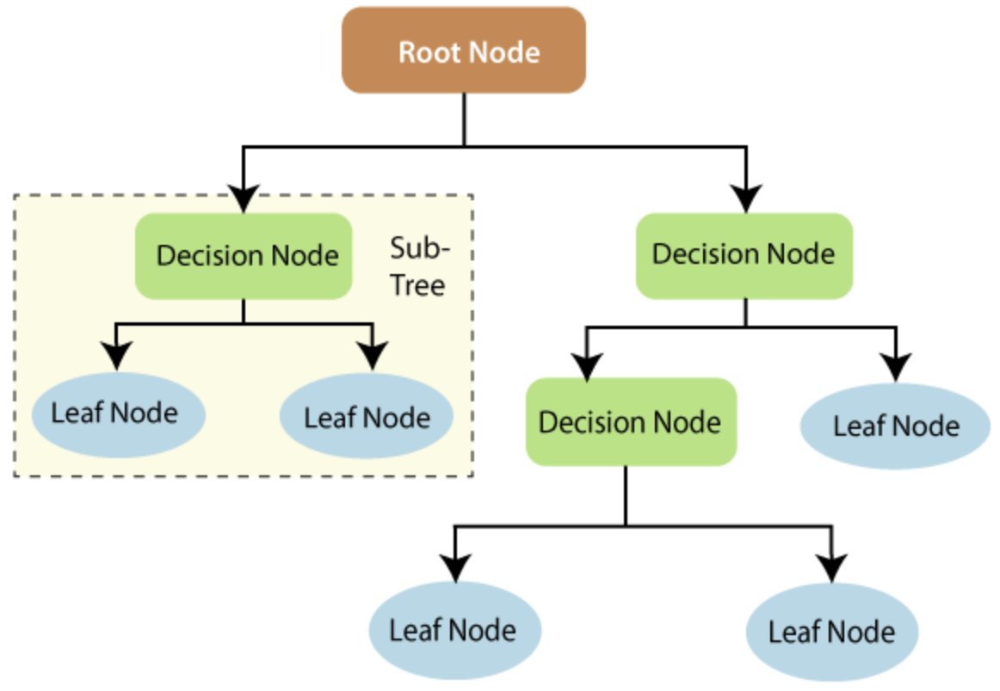
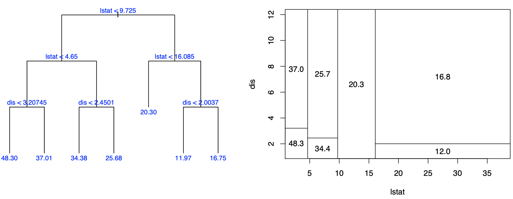
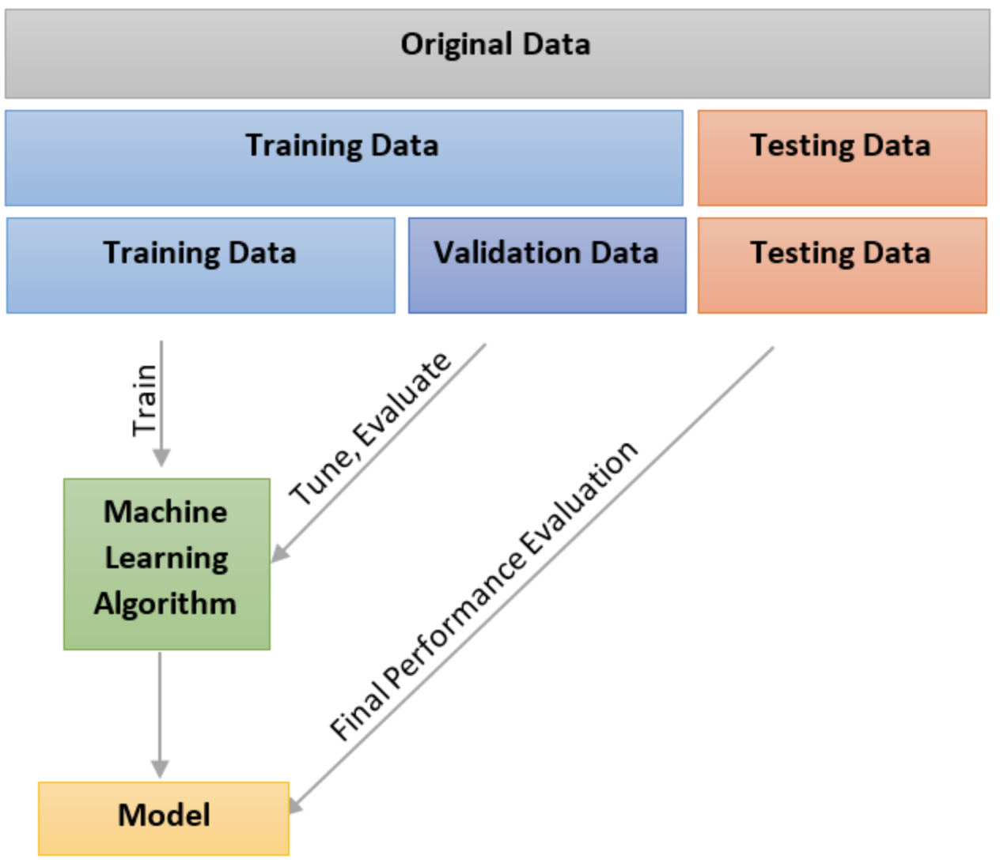

# Lesson 7.7

### Lesson Duration: 3 hours

> Purpose: The purpose of this lesson is to introduce decision trees machine learning algorithm for classification and regression problems, explain the intuition behind the algorithm, and some key parameters that can be used to fine tune the decision trees, and look at a simple implementation. We will also talk about the concepts of hyperparameter tuning and cross validation

---

### Learning Objectives: 
After this lesson, students will be able to: 

- Describe how Decision Trees solve regression and classification problems 
- Implement simple decision trees
- Identify and use key parameters while developing a decision tree model
- Understand cross validation technique
--- 

### Lesson 1 key concepts
> :clock10: 20 min

- Introduction to Tree Based Methods 
    - Intuition behind regression trees

<details>
<summary> Click for Description: Decision Trees for Machine Learning </summary>

- Decision trees can be used both for regression and classification problems

- They work with stratifying or segmenting the predictor space into a number of binary decisions to make the prediction. Each binary split consists of a decision rule which either sends us left or sends us right. This is the basic structure of a decision tree. 



- These are not as competitive as algorithms including random forests, bagging and boosting, which comprise of building hundreds or thousands of trees and then aggregating the results to yield a single prediction. We will take a look at these methods later this week. But decision trees form the basis of those aforementioned algorithms. 
</details>


<details>
<summary> Click for Description: Decision Trees for Regression </summary>

- Here we will take the example of boston housing data as it is a simpler regression problem. We used the boston data from sklearn datasets in 7.6 as well. The objective was to predict the median value of a house

- To simplify the case even further, we will take a look at the example where we have to predict the median price of a house based on only one feature "lstat"

- A decision rule to make the prediction is shown below:


- After we train the model, this is the decision space we get. The set of bottom nodes in the decision tree gives us the partition of the feature space into disjoint regions.

- For each region, we calculate the average of the target variable falling in that region of the training data. That gives us the numerical prediction value 

</details>


<details>
<summary> Click for Description: Decision Trees for Classification </summary>

-  Classification trees work in the same way as the regression trees except that instead of the final prediction being the mean of the target values falling in the disjointed region at the end, here the final prediction is the most occuring class in that region. 


- In the example above, instead of having one predictor we have multiple predictors. The decision space is divided among them. The decision at the bottom node still follows the same methodology. The final prediction is the most occuring class in the bottom nodes
</details>


---

:coffee: __BREAK__

---

#### :pencil2: Check for Understanding - Class activity/quick quiz
> :clock10: 10 min (+ 10 min Review)

<details>
  <summary> Click for Instructions: Activity 1 </summary>

- Below is an example of a decision tree with two features 

Discuss how the decision space has been developed here 

- What can you say about the target variable and how would that prediction be made in a decision tree
</details>

<details>
  <summary>Click for Solution: Activity 1 solutions</summary>

- In this case the first binary split decision is based on the column "lstat" and then on the column "dist". 

- This is an example of regression tree. The predictions are made based on the average of the target values in the leaf nodes
</details>

---

:coffee: __BREAK__

---


### Lesson 2 key concepts
> :clock10: 20 min

- Simple implementatation of regression trees
- Simple implementatation of classification trees

<details>
<summary> Click for Code Sample: Regression Tree </summary>

- For this demonstration we will use boston data set from sklearn datasets

```python

import pandas as pd
from sklearn.datasets import load_boston
X, y = load_boston(return_X_y=True)
print(X.shape)
print(y.shape)

from sklearn.tree import DecisionTreeRegressor
from sklearn.model_selection import train_test_split
X_train, X_test, y_train, y_test = train_test_split(X, y, test_size=0.33)
model = DecisionTreeRegressor()
model.fit(X_train, y_train)
model.score(X_test, y_test)
```
</details>

# The students would notice that every time they run the same algorithm, they would get a different result. This is because train test split randomized. We will look at Cross Validation techniques later that helps us find a better estimate of the model score 

<details>
<summary> Click for Code Sample: Classification Tree </summary>

- For this demonstration we will use iris data set from sklearn datasets
- Give a brief explanation about the dataset

```python

import pandas as pd
from sklearn.datasets import load_iris
X, y = load_iris(return_X_y=True)
print(X.shape)
print(y.shape)

from sklearn.tree import DecisionTreeClassifier
from sklearn.model_selection import train_test_split
X_train, X_test, y_train, y_test = train_test_split(X, y, test_size=0.33)
model = DecisionTreeClassifier()
model.fit(X_train, y_train)
model.score(X_test, y_test)
```
</details>


#### :pencil2: Check for Understanding - Class activity/quick quiz
> :clock10: 10 min (+ 10 min Review)

<details>
  <summary> Click for Instructions: Activity 2 </summary>

- What are some of the key measures used to check the accuracies of regression and classification models 
(While discussing the answers for this questions, here the instructor can ask the students some questions themselves)

- Are transformations like normalization / scaling with numerical variables, necessary with decision trees
</details>

<details>
  <summary>Click for Solution: Activity 2 solutions</summary>

- Regression - MSE, RMSE, R square, adjusted R square

- Classification - confusion matrix, misclassification rate, ROC AUC 

- Scaling numerical data is not necessary with decision trees

</details>

---


:coffee: __BREAK__

---

### Lesson 3 key concepts
> :clock10: 20 min

- Key model parameters in a decision tree
- Concept of hyperparameter tuning 

<details>
<summary> Click for Description: Intro to Parameters </summary>

- In the last lesson we implemented decision trees for classification and regression. When we initialized the model, we did not pass any arguments to the function. We chose to work with default parameters. However there is a bunch of parameters that sklearn provides. These parameters can be adjusted to better suit our requirement and to the data, to improve efficiency and accuray of the model. 

- Now we will talk about some of the key parameters available. Students are advsed to go through the documentation 
[https://scikit-learn.org/stable/modules/generated/sklearn.tree.DecisionTreeClassifier.html#sklearn.tree.DecisionTreeClassifier] 
</details>


<details>
<summary> Click for Description: Discussion on Parameters </summary>

- criterion{“gini”, “entropy”}, default=”gini” 
Defines the criteria for decision split, ie gini index vs entropy 

- min_samples_split: int or float, default=2
This is the minimum number of training samples at a decision split point, if it is to be further split into children nodes 

- min_samples_leaf: int or float, default=1
This is the minimum number of training samples at a decision split point, if it is to be further split into leaf nodes 

# note: min_samples_split and min_samples_leaf, they look very similar but difference is between children node and leaf node. Children node can be split further while a leaf node cannot be. 

- max_depthint, default=None
Defines the maximum depth of the tree. Each level of the decision split can be thought about as a depth level where the root node signifies level 0, next internal node as level 1 and so on and so forth

- max_featuresint, float or {“auto”, “sqrt”, “log2”}, default=None
This defines the maximum number of features to pick up every time when comparing the gini index or the entropy criteria for choosing the feature to make the split decision

</details>

<details>
<summary> Click for Description: What is Hyperparameter Tuning </summary>

- Breifly discuss the idea of hyperparameter tuning. We will look at the implementation later 
</details>

---

#### :pencil2: Check for Understanding - Class activity/quick quiz
> :clock10: 10 min (+ 10 min Review)

<details>
  <summary> Click for Instructions: Activity 3 </summary>

- Go through articles and read more about the parameters
[https://towardsdatascience.com/how-to-tune-a-decision-tree-f03721801680]

</details>

<details>
  <summary>Click for Solution: Activity 3 solutions</summary>

- Class discussion

</details>

---

:coffee: __BREAK__

---

### Lesson 4 key concepts
> :clock10: 20 min

- Cross Validation
    - Leave One Out Cross Validation
    - K fold cross validation

<details>
<summary> Click for Desription: Cross Validation </summary>

- When we build regression tree model and classification tree model, we observed that every time we ran the algorithm it gave us a slightly different result 

# Ask the students why was the result different - It was discussed in class earlier in the previous lesson

- To acheive a better estimate of the result / accuracy / performance of the model, we perform cross validation which basically repeats the process a number of times by randomly shuffling the dataset and fitting the model and checking the accuracy.


</details>

<details>
<summary> Click for Desription: Leave One Out Cross Validation </summary>

- This method involves splitting the training data into two parts: a single observation for eg. (x1,y1) that is used for the validation set, and the remaining observations {(x2, y2), . . . , (xn, yn)} that are used for training the model. Model accuracy is calculated for this data now

- After this, another row is picked as validation set and the rest of the information for training the model. Model accuracy is calculated

- This process is repeated 'n' number of times. 

- Average of all the accuracy measures is taken to get the final estimate

- One disadvangtage with this method is that, since we are calculating the MSE for only observation at a time, the result is a poor estimate as it is by nature higly variable

</details>

<details>
<summary> Click for Desription: K Fold Cross Validation </summary>

- This method involves splitting the data randomly into k groups / folds, of approximately equal size. The first fold is treated as a validation set, and the model is fit on the remaining k − 1 folds, which is our remaining data. The mean squared error, MSE, is then computed on the observations in the held-out/ validation fold

- After this, another fold is picked as validation set and the rest of the information for training the model. Model accuracy is calculated

- This process is repeated 'k' number of times ie for once for each fold. 

- Average of all the accuracy measures is taken to get the final estimate

- Typically, given these considerations, one performs k-fold cross-validation using k = 5 or k = 10, as these values have been shown empirically to yield test error rate estimates that suffer neither from excessively high bias nor from very high variance


</details>


---


### :pencil2: Practice on key concepts - Lab
> :clock10: 30 min 

<details>
  <summary> Click for Instructions: Lab </summary>

- Here we will continue working on the same customer churn data from the previous lab

- Apply SMOTE for upsampling the data 
  - Use logistic regression to fit the model and compute the accuracy of the model 
  - Use decision tree classifier to fit the model and compute the accuracy of the model 
  - Compare the accuracies of the two models 
   

- Apply TomekLinks for downsampling 
  - It is important to remember that it does not make the two classes equal but only removes the points from the majority class that are close to other poitns in minority class
  - Use logistic regression to fit the model and compute the accuracy of the model 
  - Use decision tree classifier to fit the model and compute the accuracy of the model 
  - Compare the accuracies of the two models 

  - You can also apply this algorithm one more time and check the how the imbalance in the two classes changed from the last time

</details>

<details>
  <summary>Click for Solution: Lab solutions</summary>

- upsampling with SMOTE
```python
from imblearn.over_sampling import SMOTE
smote = SMOTE()
X = churnData[['tenure', 'SeniorCitizen','MonthlyCharges', 'TotalCharges']]
transformer = StandardScaler().fit(X)
X = transformer.transform(X)
y = churnData['Churn']
X_sm, y_sm = smote.fit_sample(X, y)
y_sm.value_counts()

X_train, X_test, y_train, y_test = train_test_split(X_sm, y_sm, test_size=0.33)
classification_model1 = LogisticRegression(random_state=0, solver='lbfgs', multi_class='ovr').fit(X_train, y_train)
classification_model2 = DecisionTreeClassifier().fit(X_train, y_train)
print(classification_model1.score(X_test, y_test))
print(classification_model2.score(X_test, y_test))
```


- downsampling with TomekLinks

```python
from imblearn.under_sampling import TomekLinks
tl = TomekLinks('majority')
X = churnData[['tenure', 'SeniorCitizen','MonthlyCharges', 'TotalCharges']]
y = churnData['Churn']
X_tl, y_tl = tl.fit_sample(X, y)
y_tl.value_counts()

X_train, X_test, y_train, y_test = train_test_split(X_tl, y_tl, test_size=0.33)
classification_model1 = LogisticRegression(random_state=0, solver='lbfgs', multi_class='ovr').fit(X_train, y_train)
classification_model2 = DecisionTreeClassifier().fit(X_train, y_train)
print(classification_model1.score(X_test, y_test))
print(classification_model2.score(X_test, y_test))
```

- Using Tomek Links again
```python
X_tl2, y_tl2 = tl.fit_sample(X_tl, y_tl)
y_tl2.value_counts()
```
</details>

---

:sandwich: __LUNCH BREAK__

---

[ADDITIONAL RESOURCES]
https://towardsdatascience.com/scikit-learn-decision-trees-explained-803f3812290d

