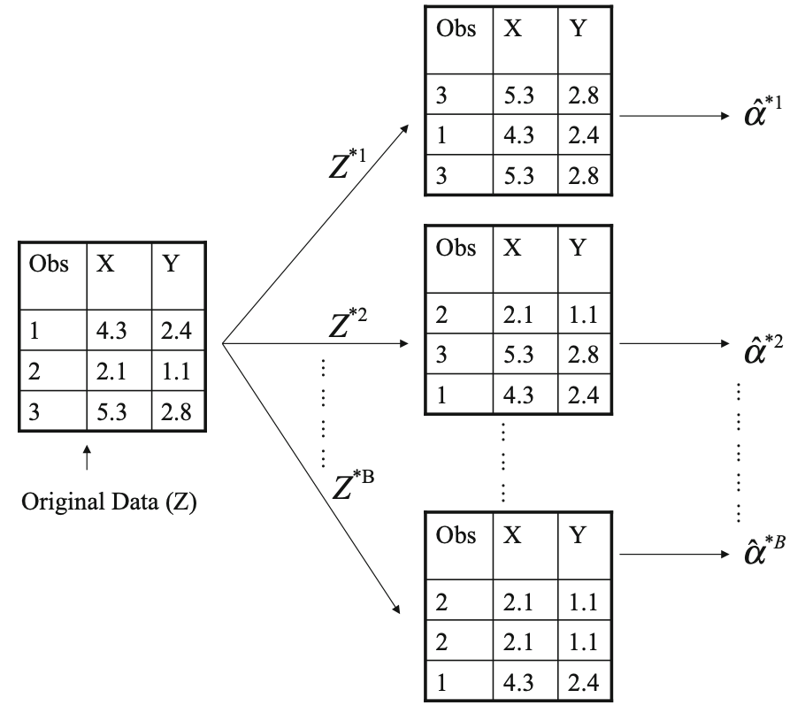
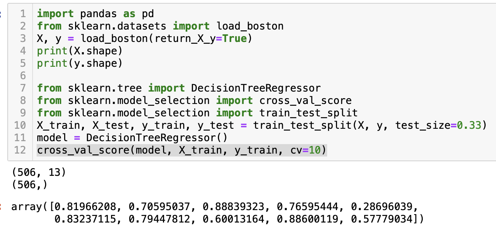

# Lesson 7.8

### Lesson Duration: 3 hours

> Purpose: In this lesson we will discuss the implementation of cross validation technique. We will then build on the concept of decision trees and talk about some techniques that are employed in machine learning to improve the prediction power of trees. We will talk about bagging and random forests, and see how to implement random forests algorithm in python

---

### Learning Objectives: 
After this lesson, students will be able to: 

- Implement K fold cross validation 
- Understand Bootstrap Method and Bagging (bootstrap Aggregate)
- Understand and implement Random Forests

--- 

### Lesson 1 key concepts
> :clock10: 20 min

- Simple implementation of K fold cross validation
- How it can be used to select the best model
    - Different Models 
    - Hyperparameter Tuning (to be discussed later with random forests)

<details>
<summary> Click for Code Sample: Simple implementation of K fold cross validation </summary>

```python
import pandas as pd
from sklearn.datasets import load_boston
X, y = load_boston(return_X_y=True)
print(X.shape)
print(y.shape)

from sklearn.tree import DecisionTreeRegressor
from sklearn.model_selection import cross_val_score
from sklearn.model_selection import train_test_split
X_train, X_test, y_train, y_test = train_test_split(X, y, test_size=0.33)
model = DecisionTreeRegressor()
cross_val_score(model, X_train, y_train, cv=10)
```
</details>

<details>
<summary> Click for Code Sample: Simple implementation of Testing Various Models with Cross Validation </summary>

- As we have discussed earlier, no one model is the better than the other. It depends on the data. Hence we will try out some different models and select the model that performs the best on the given data. 

```python

model1 = DecisionTreeRegressor()
from sklearn.linear_model import LinearRegression
model2 = LinearRegression()
from sklearn.neighbors import KNeighborsRegressor
model3 = KNeighborsRegressor()

import numpy as np
model_pipeline = [model1, model2, model3]
model_names = ['Regression Tree', 'Linear Regression', 'KNN']
scores = {}
i=0
for model in model_pipeline:
    mean_score = np.mean(cross_val_score(model, X_train, y_train, cv=10))
    scores[model_names[i]] = mean_score
    i = i+1
print(scores)

# We can use the result to choose the best performing model 
```
</details>
---

:coffee: __BREAK__

---

#### :pencil2: Check for Understanding - Class activity/quick quiz
> :clock10: 10 min (+ 10 min Review)

<details>
  <summary> Click for Instructions: Activity 1 </summary>

- In this exercise we will go back to the customer churn data from the last lab 
- Implement cross validation along with logistic regression and decision tree classifier on the data
  - Create a pipeline as shown in the class example
  - Note: you can directly use the upsampled data from SMOTE technique

</details>

<details>
  <summary>Click for Solution: Activity 1 solutions</summary>


```python
X_train, X_test, y_train, y_test = train_test_split(X_sm, y_sm, test_size=0.33)
classification_model1 = LogisticRegression(random_state=0, solver='lbfgs', multi_class='ovr')
classification_model2 = DecisionTreeClassifier()

import numpy as np
model_pipeline = [classification_model1, classification_model2]
model_names = ['Logistic Regression', 'Decision Tree Classifier']
scores = {}
i=0
for model in model_pipeline:
    mean_score = np.mean(cross_val_score(model, X_train, y_train, cv=10))
    scores[model_names[i]] = mean_score
    i = i+1
print(scores)
```

</details>

---

:coffee: __BREAK__

---


### Lesson 2 key concepts
> :clock10: 20 min
    
- Bootstrap method
- Introduction to Bagging (Bootstrap Aggregate)
  - Aggregating Trees

<details>
<summary> Click for Description: Bootstrap</summary>

- Before we understand Bagging, we need to understand bootstraping technique 

- Bootstrap - To produce a reliable estimate we need enough samples in the dataset but sometimes it is not possible to collect enough real data. Bootstrap method allows us to emulate the process of obtaining new sample sets from the original data. Hence bootstaping is the process of generating distinct data sets by repeatedly sampling observations (with replacement) from the original data set. 



In the image above, we are generating 'B' bootstrap samples from the original dataset. Since sampling is done with replacement, you would observe some repitition in the rows in some bootstrap samples. Each bootstrap sample is used to estimate alpha (for example which could be a measure of accuracy for a linear regression model). Then we take the mean of all alpha scores to obtain a more reliable final estimate. 
</details>


<details>
<summary> Click for Description: Bagging (Bootstrap Aggregate) </summary>

- Why do we need bagging technique? 
    - One of the disadvantages with decision trees is that they have high variability in the result ie the results produced can vary greatly in their accuracy measures. This can be seen from the snapshot below:



- Bagging is a general purpose technique that is used to reduce variance in a machine learning model. The idea is to use B Bootstrap samples and find the accuracy measure for each bootstrap sample. And then aggregate the results of all the bootstrap samples. This method is particularly useful for decision trees. 

- Bagging applied decision trees: B bootstrapped training sets are sampled from the original data. On each bootstrap sample, a decision tree is fit and a prediction is made. Then we average the resulting predictions. These trees are grown deep and have high variance. Averaging these B trees reduces the variance.

- Essentially we are combining the results from hundreds or thousands of independently grown decision trees. 
</details>


#### :pencil2: Check for Understanding - Class activity/quick quiz
> :clock10: 10 min (+ 10 min Review)

<details>
  <summary> Click for Instructions: Activity 2 </summary>

- What are the advantages and disadvantages of using bootstrap method?
[https://blog.paperspace.com/bagging-ensemble-methods/]
# This is a good resource to refer

- What are the advantages and disadvantes of bagging?

</details>

<details>
  <summary>Click for Solution: Activity 2 solutions - Bootstrap</summary>

- Advantages
  - Helps generate more samples from the original data. This is helpful when it is not possible to gather enough data from a process or the costs involved with taking new samples is high

  - For sampling new data, it does not depend on the assumptions of underlying parametric distribution in the data

  - Reduces variability in the data 

- Disadvanatages
  - Depends on representative sample which could be good as well as bad. For eg,if the original data has extreme values, bootstrap method will reduce the frequency of appearance of such values in the overall data. If those were values were actually outliers, then it is a good thing as we undermining the importance of such data points in the overall data at the end. However, if those data points are some rare important observations, then this could be bad. 
  - The method does not work very well when the original sample size is too small

</details>

<details>
  <summary>Click for Solution: Activity 2 solutions - Bagging</summary>

- Advantages
  - Prevents overfitting
  - Different models are built independent of each other and equal weight is given to all the models 
  - The concept of "wisdom of crowds" which essentially means that the knowledge of a group of people is higher than knowledge of people independently 

- Disadvanatages
  - Loss of interpretability; The final output is not interpretable like a decision where we can clearly see the decision spaces 
  - Computation complexity of the model increases
  - It works well when the base classifier is good. If the base classifier is bad, then it can significantly decrease the performance 

</details>

---


:coffee: __BREAK__

---

### Lesson 3 key concepts
> :clock10: 20 min

- Random Forests
- Parameters for random forests algorithm 

<details>
<summary> Click for Description: Random Forests </summary>

- Random Forests are very similar to bagging except for one improvement over bagging method in terms of randomization of features chosen while building a tree for each bootstrap sample.

- It also consists of building a large number of trees (a decision for each bootstrap sample). 
- For each decision tree for each bootstrap sample, instead of picking all the features while making the decision tree, only a random sample of 'm' features are chosen from the total set of 'p' predictors. 
- Hence the name random forests
- There is no rule of thumb / best value of 'm' but usually m is chosen as the square root of 'p' as a good starting point
- Using a small value of m in building a random forest will typically be helpful when we have a large number of correlated predictors

(NOte when m=p then it is the same as bagging process)
# We will check the implementation later in the lessons 
</details>

</details>

<details>
  <summary>Click for Description: Parameters in Random Forest Algorithm</summary>

- n_estimators: int, default=100  - The number of trees in the forest.

- max_features{“auto”, “sqrt”, “log2”}, int or float, default=”auto” - The number of features to consider when looking for the best split

- bootstrapbool, default=True : Whether bootstrap samples are used when building trees. If False, the whole dataset is used to build each tree.

- Some of these other parameters are the same ones as we have looked in decision trees. 
  - criterion{“gini”, “entropy”}, default=”gini”

  - max_depthint, default=None

  - min_samples_splitint or float, default=2

  - min_samples_leafint or float, default=1

</details>

---

#### :pencil2: Check for Understanding - Class activity/quick quiz
> :clock10: 10 min (+ 10 min Review)

<details>
  <summary> Click for Instructions: Activity 3 </summary>

- Go through the documentation of random forests in sklearn, and go throught the various parameters that can be used 
- There is another advanced concept called boosting. Conduct some elementary research on boosting and compare it with bagging 
</details>

<details>
  <summary>Click for Solution: Activity 3 solutions</summary>

- Reading the documentation
[https://scikit-learn.org/stable/modules/generated/sklearn.ensemble.RandomForestClassifier.html]

- Boosting : We will not get into the details, but just give a quick overview 
</details>

---

:coffee: __BREAK__

---

### Lesson 4 key concepts
> :clock10: 20 min

- Using a random forest model on mail promotion data

- The first objective here is to make a classification model and predicting who are the customers that are more likely to respond 

- The customers who are more likely to respond, on those predicted customers we will create a regeression model to predict the amount of money they will donate

- It is important to note how we will retain the information from the column "TARGET_D" which is the target column for the regression model 

- For the classification model now, we will use the cleaned data from the provided csv files. 
  - numerical.csv has the numerical features (not normalized)
  - categorical.csv has the categorical columns (not encoded)
  - target.csv has the two target columns 'TARGET_B' and 'TARGET_D'

# In the example below we will use downsampling to balance the two categories in the classification model. We will check the accuracy of the model in class. Then the students will be asked to use upsampling using SMOTE instead, to check how the accuracy of the model changes 

# Note: This lesson would stretch beyond 20 mins. Some parts of the code in the beginning could be covered faster as that should be something the students would be familiar with, very well


<details>
<summary> Click for Code Sample: Reading the data </summary>

```python
import pandas as pd
import numpy as np
pd.set_option('display.max_columns', None)
import warnings
warnings.filterwarnings('ignore')

numerical = pd.read_csv('numerical.csv')
categorical = pd.read_csv('categorical.csv')
targets = pd.read_csv('target.csv')
data = pd.concat([numerical, categorical, targets], axis = 1)
data['TARGET_B'].value_counts()
```
</details>


<details>
<summary> Click for Code Sample: Downsampling to balance data </summary>

```python
category_0 = data[data['TARGET_B']==0].sample(len(data[data['TARGET_B']==1]))
print(category_0.shape)

category_1 = data[data['TARGET_B']== 1 ]
data = pd.concat([category_0, category_1], axis = 0)
data = data.sample(frac =1)
data = data.reset_index(drop=True)
print(data.shape)
```
</details>

<details>
<summary> Click for Code Sample: Data Processing </summary>

```python
y = data['TARGET_B']
X = data.drop(['TARGET_B'], axis = 1)

numericalX = X.select_dtypes(np.number)
categorcalX = X.select_dtypes(np.object)

from sklearn.preprocessing import OneHotEncoder
encoder = OneHotEncoder(drop='first').fit(categorcalX)
encoded_categorical = encoder.transform(categorcalX).toarray()
encoded_categorical = pd.DataFrame(encoded_categorical)
X = pd.concat([numericalX, encoded_categorical], axis = 1)

from sklearn.model_selection import train_test_split
X_train, X_test, y_train, y_test = train_test_split(X, y, test_size=0.25, random_state=0)
```
</details>


<details>
<summary> Click for Code Sample: Retaining Info for Regression Model for Later </summary>

```python
X_train = pd.DataFrame(X_train)
X_test = pd.DataFrame(X_test)

y_train_regression = X_train['TARGET_D']
y_test_regression = X_test['TARGET_D']

# Now we can remove the column target d from the set of features 
X_train = X_train.drop(['TARGET_D'], axis = 1)
X_test = X_test.drop(['TARGET_D'], axis = 1)
```
</details>


<details>
<summary> Click for Code Sample: Building the model </summary>

```python
from sklearn.ensemble import RandomForestClassifier
clf = RandomForestClassifier(max_depth=2, random_state=0)
clf.fit(X_train, y_train)
print(clf.score(X_test, y_test))

# For cross validation
from sklearn.model_selection import cross_val_score
clf = RandomForestClassifier(max_depth=2, random_state=0)
cross_val_scores = cross_val_score(clf, X_train, y_train, cv=10)
print(np.mean(cross_val_scores))
```
</details>


---


### :pencil2: Practice on key concepts - Lab
> :clock10: 30 min 

<details>
  <summary> Click for Instructions: Lab </summary>

- Apply the Random Forests algorithm but this time only by upscaling the data using SMOTE  

- Note that since SMOTE works on numerical data only, we will first encode the categorical variables in this case 
</details>

<details>
  <summary>Click for Solution: Lab solutions</summary>


```python
import pandas as pd
import numpy as np
pd.set_option('display.max_columns', None)
import warnings
warnings.filterwarnings('ignore')

from sklearn.preprocessing import OneHotEncoder
from sklearn.model_selection import train_test_split
from sklearn.ensemble import RandomForestClassifier
```

```python
numerical = pd.read_csv('numerical.csv')
categorical = pd.read_csv('categorical.csv')
targets = pd.read_csv('target.csv')
data = pd.concat([numerical, encoded_categorical, targets], axis = 1)
y = data['TARGET_B']
X = data.drop(['TARGET_B'], axis = 1)
```

```python
from imblearn.over_sampling import SMOTE
smote = SMOTE()
y = data['TARGET_B']
X = data.drop(['TARGET_B'], axis=1)
X_sm, y_sm = smote.fit_sample(X, y)
y_sm.value_counts()
```

```python
from sklearn.model_selection import train_test_split
X_train, X_test, y_train, y_test = train_test_split(X_sm, y_sm, test_size=0.25, random_state=0)

X_train = pd.DataFrame(X_train)
X_test = pd.DataFrame(X_test)

y_train_regression = X_train['TARGET_D']
y_test_regression = X_test['TARGET_D']

# Now we can remove the column target d from the set of features 
X_train = X_train.drop(['TARGET_D'], axis = 1)
X_test = X_test.drop(['TARGET_D'], axis = 1)
```

```python
clf = RandomForestClassifier(max_depth=2, random_state=0)
clf.fit(X_train, y_train)
print(clf.score(X_test, y_test))
```


</details>

---

:sandwich: __LUNCH BREAK__

---