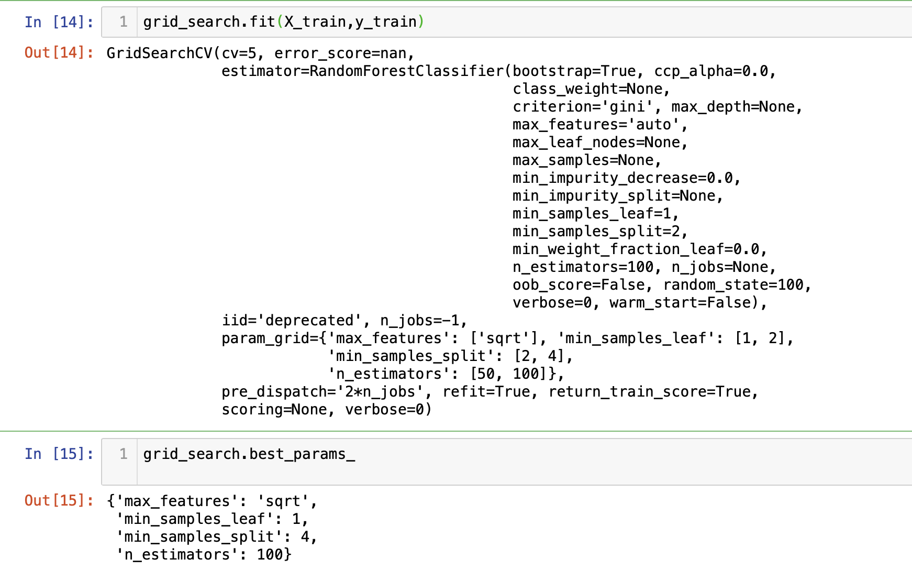
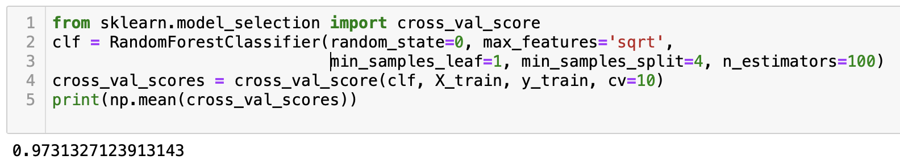

# Lesson 7.9

### Lesson Duration: 3 hours

> Purpose: The purpose of this lesson is to deep dive further into random forests and understand how we can tune different parameters in the algorithm to improve the performance of the model. We will then talk about final week's projects, expectations from the students, and the deliverables.

---

### Learning Objectives: 
After this lesson, students will be able to: 

- Identify the main benefits of Random Forest Algorithm
- Perform Hyperparameter tuning
- Rank Feature by Importance with Random Forests

--- 

### Lesson 1 key concepts
> :clock10: 20 min

- Quick review on Random Forests
- Some of its key parameters
- Discuss advantages of random forests 
- Hyperparameter tuning 

<details>
<summary> Click for Description: Review, key parameters</summary>

Notes from previous class
</details>


<details>
<summary> Click for Description: Advantages</summary>

- Scaling numerical features is not necessary

- Important features in the data automatically shine through. The algorithm intrinsically takes care of feature selection to a large extent

</details>


<details>
<summary> Click for Description: Hyperparameter Tuning </summary>

- In the previous class we implemented random forests but we used the default arguments. As discussed above there are a lot of parameters that can be modified to fine tune the algorithm even further, and hence improve the performance of the model. 

- This fine tuning the parameters of any algorithm is called Hyperparameter tuning. We would use a grid search cross-validation technique to accomplish this. We will discuss the code later. 

- Some parameters that can greatly affect the performance of random forests are mentioned below:

n_estimators = [200, 500, 1000, 2000, 4000]
min_samples_split = [2, 4, 8, 16, 32]
min_samples_leaf = [1, 2, 3, 4, 5]
max_features = ['sqrt', 'log2']
max_samples = ['None', 0.5, 0.8]

- This is also known as **grid search** as this can also be thought of a grid of possible combinations of all the different values of various parameters that we want to test. Basically the model is tested for each point on the grid and the best combination of values of the parameters is chosen

- In the next lesson we will show how to implement hyperparameter tuning
</details>


---

:coffee: __BREAK__

---

#### :pencil2: Check for Understanding - Class activity/quick quiz
> :clock10: 10 min (+ 10 min Review)

<details>
  <summary> Click for Instructions: Activity 1 </summary>

- What are some of the advantages and disadvantages of hyperparameter tuning 

</details>

<details>
  <summary>Click for Solution: Activity 1 solutions</summary>

- Advantages
  - easy to implement

  - Process is parallelizeable 

- Disadvantages 
  - Computationally very expensive: If the range of values of different parameters are used, then the algorithm might take a really long time to produce the results. It suffers from the curse of dimensionality as well. The number of points on the grid exponentially increases with increase in the number of parameters

  - In theory, we might never be able to find the best possible combination
    - It depends on human knowledge of various parameters ie values of the parameters are manually set. To avoid this there is another method, whihc is called randomized grid search. 

</details>

---

:coffee: __BREAK__

---


### Lesson 2 key concepts
> :clock10: 20 min

- Implementing hyperparameter tuning 

<details>
<summary> Click for Code Sample </summary>

- Most of the code shown below is the same as the code used in the last lesson, while prepare and process the data 

```python
import pandas as pd
import numpy as np
pd.set_option('display.max_columns', None)
import warnings
warnings.filterwarnings('ignore')

from sklearn.preprocessing import OneHotEncoder
from sklearn.model_selection import train_test_split
from sklearn.ensemble import RandomForestClassifier

numerical = pd.read_csv('numerical.csv')
categorical = pd.read_csv('categorical.csv')
targets = pd.read_csv('target.csv')

encoder = OneHotEncoder(drop='first').fit(categorical)
encoded_categorical = encoder.transform(categorical).toarray()
encoded_categorical = pd.DataFrame(encoded_categorical)

data = pd.concat([numerical, encoded_categorical, targets], axis = 1)
regression_target = data['TARGET_D']
# data.head()
y = data['TARGET_B']
X = data.drop(['TARGET_B'], axis = 1)

from imblearn.over_sampling import SMOTE
smote = SMOTE()
y = data['TARGET_B']
X = data.drop(['TARGET_B'], axis=1)
X_sm, y_sm = smote.fit_sample(X, y)
y_sm.value_counts()

from sklearn.model_selection import train_test_split
X_train, X_test, y_train, y_test = train_test_split(X_sm, y_sm, test_size=0.25, random_state=0)

X_train = pd.DataFrame(X_train)
X_test = pd.DataFrame(X_test)

y_train_regression = X_train['TARGET_D']
y_test_regression = X_test['TARGET_D']
```
</details>

<details>
  <summary> Click for Code Sample: Grid Search </summary>

- In this case we are not using an extensive set of options for different parameters as the code takes a long time to run
```python
from sklearn.model_selection import GridSearchCV
param_grid = {
    'n_estimators': [50, 100], 
    'min_samples_split': [2, 4], 
    'min_samples_leaf' : [1, 2],
    'max_features': ['sqrt']
#    'max_samples' : ['None', 0.5]
    }
clf = RandomForestClassifier(random_state=100)

grid_search = GridSearchCV(clf, param_grid, cv=5,return_train_score=True,n_jobs=-1)
grid_search.fit(X_train,y_train)
grid_search.best_params_ #To check the best set of parameters returned
```
- Here is a snapshot of the results


</details>

<details>
  <summary>Click for Code Sample: USing the above results</summary>

```python
from sklearn.model_selection import cross_val_score
clf = RandomForestClassifier(random_state=0, max_features='sqrt', min_samples_leaf=1, min_samples_split=4, n_estimators=100)
cross_val_scores = cross_val_score(clf, X_train, y_train, cv=10)
print(np.mean(cross_val_scores))
```
- Here is a snapshot of the final output using the best parameters returned by grid search CV

</details>


#### :pencil2: Check for Understanding - Class activity/quick quiz
> :clock10: 10 min (+ 10 min Review)

<details>
  <summary> Click for Instructions: Activity 2 </summary>

- Read about randomized grid search CV
Why would we need it 
[https://scikit-learn.org/stable/modules/generated/sklearn.model_selection.RandomizedSearchCV.html]

</details>

<details>
  <summary>Click for Solution: Activity 2 solutions</summary>

: Since the class lectures are intense, we are having simple class discussions here 
- Class discussion on randomized grid search and how it is different than simple grid search 

</details>

---


:coffee: __BREAK__

---

### Lesson 3 key concepts
> :clock10: 20 min

- Checking feature importance using random forests

<details>
<summary> Click for Code Sample </summary>

- It uses impurity-based feature importance measure

- Higher the score, the more important the feature is 

```python
clf.fit( X_train, y_train)
X_train.head()
feature_names = X_train.columns
feature_names = list(feature_names)

df = pd.DataFrame(list(zip(feature_names, clf.feature_importances_)))
df.columns = ['columns_name', 'score_feature_importance']
df.sort_values(by=['score_feature_importance'], ascending = False)

```
</details>

#### :pencil2: Check for Understanding - Class activity/quick quiz
> :clock10: 10 min (+ 10 min Review)

<details>
  <summary> Click for Instructions: Activity 3 </summary>

- In the lesson we mentioned about impurity measures. Gini index is one of the impurity measures. Here is a link to an article on gini index. Please go through this article 
[https://victorzhou.com/blog/gini-impurity/]

</details>

<details>
  <summary>Click for Solution: Activity 3 solutions</summary>

- Class discussion on impurity measures and how they are used in decision trees

</details>

---

:coffee: __BREAK__

---

### Lesson 4 key concepts
> :clock10: 20 min

- Boosting

<details>
<summary> Click for Description </summary>

- Boosting is another technique that is used to improve the performance of machine learning models

- With bagging and random forests, we generate bootstrap samples from the original data and fit a decision on each of the bootstrap samples. Then we aggregate the trees to create a final predictive model. Essentially each tree is built independent of the other trees. 

- However with boosting, the trees are built sequentially using information from previously built trees. It does not use bootstrap samples but instead each new tree is built an a modified version of the original data. 

- Hence, instead of fitting one large tree on the original dataset, which leads to overfitting usually, boosting method learns slowly, by improving on the previously built tree gradually. 
</details>

---

---


### Project discussion instead of the lab. 
I have left this space also because I am thinking of introducing how to use a machine learning algorithm in production                                                                                                                                                                                                                                                                                                                                                                                                                                                                                                                                                     